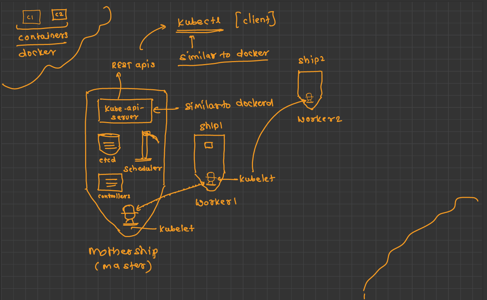

# Detailed Notes: Kubernetes & Orchestration

*(Based on the course deck `kubernetes.pdf`, cleaned up and expanded with extra interview-depth context.)*

---

## 25. Kubernetes & Orchestration

### 25.1 What is Kubernetes?
- A **portable, extensible, open-source platform** for managing containerized workloads and services.
- Facilitates both **declarative configuration** (you describe *what* you want, in YAML) and **automation** (controllers make it happen).
- Has a large, rapidly growing ecosystem — services, support, and tooling are widely available.
- The name comes from Greek, meaning **"helmsman"** or **"pilot"** (the one who steers the ship — fits the container-shipping metaphor: containers, "ships," a captain per ship). Google open-sourced it in **2014**.
- Core mental model: you declare **desired state** ("I want 3 replicas of this image with this config"), and small background loops called **controllers** continuously check whether actual state matches desired state — if you need 3 replicas and only 2 are running, a controller creates the 3rd. This reconcile-loop pattern, plus continuous **health checks**, is the idea underneath almost every Kubernetes feature.

### 25.2 How we got here: the three deployment eras

**1. Traditional deployment (physical servers)**
```
 App   App   App   App
 -------------------------
      Bin/Library
 -------------------------
    Operating System
 -------------------------
        Hardware
```
- Applications ran directly on physical servers — no way to define resource boundaries.
- One greedy application could starve the others on the same box (noisy neighbor problem).
- Fix: one application per physical server — but this doesn't scale. Resources sit underutilized, and buying/maintaining many physical servers is expensive.

**2. Virtualized deployment (VMs)**
```
   Virtual Machine        Virtual Machine
 [App][App][App]         [App][App][App]
   Bin/Library              Bin/Library
 Operating System        Operating System
 -----------------------------------------
              Hypervisor
 -----------------------------------------
           Operating System
 -----------------------------------------
              Hardware
```
- A hypervisor lets multiple VMs run on one physical server's CPU.
- Each VM is a **full machine** — its own OS, kernel, everything — running on top of virtualized hardware.
- Benefits: isolation (one app's data isn't freely visible to another), better resource utilization, easier to add/update an application, lower hardware cost, and a physical machine can be presented as a cluster of disposable VMs.

**3. Container deployment**
```
     Container                Container
   [App][App][App]          [App][App][App]
     Bin/Library               Bin/Library
 ------------------------------------------
             Container Runtime
 ------------------------------------------
             Operating System
 ------------------------------------------
                Hardware
```
- Containers are like VMs but with **relaxed isolation** — they share the host OS kernel instead of each bundling their own. This makes them **lightweight** (fast to start, small on disk) compared to a VM.
- Like a VM, a container still gets its own filesystem, CPU/memory share, and process space.
- Because they're decoupled from the underlying infrastructure, containers are **portable** across clouds and OS distributions.

**Container benefits (why the industry moved here):**
- Faster, more efficient image creation than building VM images.
- Enables continuous development, integration, and deployment (CI/CD).
- Clean separation of concerns between Dev (builds the container) and Ops (runs it).
- Better observability — not just OS-level metrics, but application health signals.
- Cloud/OS portability.
- Application-centric management — you think in terms of services, not machines.
- Enables loosely coupled, distributed, elastic microservices.
- Resource isolation → predictable application performance.

Containers solved packaging and portability. **Kubernetes exists because running containers at scale — across many machines, with restarts, scaling, and zero-downtime updates — is a distributed-systems problem that containers alone don't solve.**

### 25.3 What Kubernetes provides
- **Service discovery & load balancing** — Kubernetes can expose a container via a DNS name or its own IP, and if traffic to a container is high, it load-balances and distributes traffic to keep the deployment stable.
- **Storage orchestration** — automatically mount a storage system of your choice (local disk, a public cloud provider's storage, etc.).
- **Automated rollouts & rollbacks** — describe the desired state for your containers, and Kubernetes changes actual state to desired state at a controlled rate (see §25.19 for rollout strategies).
- **Automatic bin packing** — you give Kubernetes a cluster of nodes and tell it how much CPU/memory each container needs; it fits containers onto nodes to make the best use of your resources (like efficiently packing boxes into a container).
- **Self-healing** — restarts containers that fail, replaces containers, kills containers that don't respond to your user-defined health check, and won't advertise a container to clients until it's actually ready to serve (see §25.16, liveness vs readiness).
- **Secret & configuration management** — store and manage sensitive information (passwords, OAuth tokens, SSH keys) and deploy/update config **without rebuilding your container image** and without hardcoding secrets into your stack config (see §25.14).

### 25.4 What Kubernetes is *not*
Important boundary-setting — a common source of confusion:
- Does **not** limit the types of applications it supports (any kind of app can run in a container).
- Does **not** deploy your source code and does **not** build your application — that's the job of CI/CD pipelines and build tools (Maven, Gradle, Ant, etc.). Kubernetes takes a built container image as input.
- Does **not** provide application-level services (message buses, databases, caches) as built-ins — you deploy those as workloads yourself, or consume them as managed cloud services.
- Does **not** dictate a logging, monitoring, or alerting solution — you bring your own (Prometheus, ELK, Datadog...).
- Does **not** mandate a configuration language/system beyond its own API objects (which you typically author as YAML or JSON).
- Does **not** provide or adopt any comprehensive machine configuration/maintenance/self-healing system for the underlying nodes themselves (that's the job of the infrastructure layer — e.g. a cloud provider's managed node pools, or tools like Ansible).

In short: **Kubernetes orchestrates containers you already built; it is not a CI system, not a PaaS with built-in databases, and not a config-management tool for the host OS.**

### What is Pod? 
- Inside one Pod, you have 1 or more containers (usually just 1).
- **It has its own IP**- all containers inside one Pod share the same IP and can talk to each other like localhost
- **They share storage** - if you attach a volume to a Pod, all containers in it can see it.
- It's temporary - Pods die. They are not meant to be fixed. If it dies, k8s creates a new Pod in its place. That's why you don't store important data inside a Pod.

### Why Pod? 
- Real apps need a helper containers - These containers must be together, on the same machine, die together, start together. -  **Sidecar pattern**
- To manage them as one unit - k8s wants to schedule, scale, restart, and kill your app as one thing

### 25.5 Kubernetes cluster — the big picture
- Deploying Kubernetes gives you a **cluster**: a set of machines (**nodes**) running containerized applications, managed by Kubernetes.
- A cluster has **at least one worker node** and **at least one master node** (also called the **control plane**).
  - **Worker node(s)** host the **Pods** — the actual running components of your application.
  - **Master node(s)** manage the worker nodes and the Pods in the cluster — they make the scheduling and health decisions.
- **Multiple master nodes** are used to give the cluster **failover and high availability** (if one master goes down, the cluster keeps functioning) — this is the standard setup for a **production** cluster.

```
                 Master (control plane)
                 /                    \
           worker  <---- service ---->  worker
        [containers]                 [containers]
```

**Cluster sizing patterns you'll encounter:**
| Setup | Master(s) | Worker(s) | Typical use |
|---|---|---|---|
| minikube | 1 (same node as worker) | 1 | Local learning / development |
| Single-master cluster | 1 | multiple | Dev / staging |
| Multi-master cluster | multiple | multiple | Production (HA) |

### 25.6 Kubernetes components — master vs node

**The analogy that makes this click:** think of the cluster as a fleet of ships. The **master is the "mothership"** — it holds the maps, the crew roster, and gives orders. Each **worker is a "ship"** with its own **captain (`kubelet`)** who receives orders from the mothership and makes sure the right containers are actually running onboard. **`kubectl`** is the client you (the fleet admiral) use to talk to the mothership — conceptually similar to how the `docker` CLI talks to `dockerd`.


**Master components:**
- Master components make global decisions about the and they detect and respond to cluster events
- Master components can be run on any machine(node) in the cluster
- **`kube-apiserver`** — exposes the Kubernetes REST API; this is the **front end** to the cluster. Every tool (`kubectl`, dashboards, controllers) talks to Kubernetes only through this API — nothing talks to `etcd` directly.
- `kubectl` is the command-line client for Kubernetes. sends requests to the `kube-apiserver`
- **`etcd`** — noSQL db.. consistent and highly available **key-value store** used as Kubernetes' backing database for **all** cluster data (desired state, current state, config, secrets). Not just a cache like Redis — it's the **source of truth**, and it uses the **Raft consensus algorithm** to stay consistent across multiple copies (so writes are agreed upon by a quorum, and reads can come from any member).
- **`kube-scheduler`** — watches for newly created Pods that have no node assigned yet, and picks a node for them to run on (based on resource requests, constraints, affinity rules, etc.).
- **`kube-controller-manager`** — runs the **controllers**, the reconciliation loops that are Kubernetes' core mechanism. Logically each controller is a separate process, but they're compiled into one binary for simplicity. Key controllers:
  - **Node Controller** — notices and responds when nodes go down.
  - **Replication Controller** — keeps the correct number of Pods running for every replication object.
  - **Endpoints Controller** — populates the Endpoints object, i.e. joins Services to the Pods that back them.
  - **Service Account & Token Controllers** — create default accounts and API access tokens for new namespaces.
- **`cloud-controller-manager`** — runs controllers that talk to the underlying cloud provider's APIs (e.g. provisioning a cloud load balancer when you create a `LoadBalancer` Service).

**Node components (run on every worker node):**
- **`kubelet`** — the agent that runs on each node; makes sure containers are running in a pod and reports node/Pod health back to the master.
- **`kube-proxy`** — a network proxy that runs on each node: it maintains network rules on the node so allows network communication to your Pods from network sessions inside or outside of your cluster
- **`Container runtime`** — the software that actually runs containers (Docker, containerd, CRI-O, rktlet, etc.) — `kubelet` talks to it through the Container Runtime Interface (CRI).

### 25.7 Setting up a cluster (kubeadm, at a glance)
Install the tooling on **every** node (master and workers):

Initialize the **master**:
```bash
kubeadm init --apiserver-advertise-address=<ip-address> --pod-network-cidr=10.244.0.0/16
mkdir -p $HOME/.kube
sudo cp -i /etc/kubernetes/admin.conf $HOME/.kube/config
sudo chown $(id -u):$(id -g) $HOME/.kube/config

# install a pod network add-on so Pods on different nodes can reach each other
kubectl apply -f https://raw.githubusercontent.com/coreos/flannel/<ref>/Documentation/kube-flannel.yml
```

Join each **worker** using the token/hash printed by `kubeadm init`:
```bash
kubeadm join --token <token> <control-plane-host>:<control-plane-port> \
  --discovery-token-ca-cert-hash sha256:<hash>
```

```
Step:        1        2         3           4              5
Master:    docker → kubeadm → initialize ─┐
Worker 1:  docker → kubeadm ──────────────┤── POD Network ──▶ join
Worker 2:  docker → kubeadm ──────────────┘                   join
```
The **pod network add-on** (step 4) is what stitches all the nodes together into one flat network so Pods can talk to each other regardless of which node they land on — nothing works cross-node until this is installed.

### 25.8 Kubernetes objects — the vocabulary
**Basic objects:**
- **Pod** — smallest deployable unit (§25.10)
- **Service** — stable network identity for a set of Pods (§25.13)
- **Volume** — storage that outlives a container (§25.15)
- **Namespace** — a scope for names (§25.9)

**Higher-level abstractions built on top of the basics:**
- **Deployment** — manages ReplicaSets of stateless Pods (§25.12)
- **ReplicaSet** — keeps N identical Pods running (§25.11)
- **StatefulSet** — like a Deployment, but for stateful apps that need a stable identity/hostname and stable storage per replica (databases, queues)
- **DaemonSet** — runs exactly one Pod per node (log shippers, node monitoring agents)
- **Job** — runs a Pod to completion (a batch task), rather than keeping it running forever

### 25.9 Namespace
- Namespaces exist for environments with **many users spread across multiple teams or projects** — they let a cluster be safely shared.
- A namespace provides a **scope for names**: resource names must be unique *within* a namespace, but the same name can exist in two different namespaces.
- Namespaces **cannot be nested** — a resource lives in exactly one namespace.
- In short: namespaces are a way to **divide cluster resources** between multiple users/teams (often paired with resource quotas and RBAC per namespace).

### 25.10 Pod — the smallest deployable unit
- The **basic execution unit** of a Kubernetes application — the smallest, simplest object you create or deploy.
- Represents one running process (or tightly-coupled group of processes) on the cluster; it's the unit of **deployment**.
- A Pod encapsulates:
  - the application container(s)
  - storage resources
  - a **unique network IP**, shared by everything inside the Pod
  - options governing how the container(s) should run

```
 Single-container Pod                 Multi-container Pod
 ┌─────────────────┐        10.5.6.8  ┌───────────────────────────┐
 │  10.5.6.7        │                 │ init container            │
 │ ┌───────────┐    │                 │   (runs first, then exits)│
 │ │  apache   │    │                 │ ┌───────────┐ ┌─────────┐ │
 │ │ (:80)     │    │                 │ │ express   │ │ mysql   │ │
 │ └───────────┘    │                 │ │ (:4000)   │ │(sidecar)│ │
 └─────────────────┘                  │ └───────────┘ └─────────┘ │
                                       └───────────────────────────┘
```
- **Single-container Pod** is the common case — one container per Pod (e.g. an `httpd` server), one IP.
- **Multi-container Pod** — multiple containers that must share network/storage. Two common patterns:
  - **Init container** — runs and completes *before* the main app container starts (e.g. run a migration, wait for a dependency).
  - **Sidecar container** — runs alongside the main container for the Pod's whole lifetime (e.g. a log shipper, a service-mesh proxy, or here, a colocated `mysql` next to an `express` app).
- Pods are **ephemeral and disposable** — expected to crash, be terminated, and get replaced constantly without anything breaking. This is exactly why you almost never create a bare Pod directly in production — you manage it through a Deployment/ReplicaSet/StatefulSet, which recreates Pods automatically when they die.

### 25.11 The YAML manifest format (AKMS)
Every Kubernetes object is described declaratively, almost always as **YAML** (JSON also works, YAML is just friendlier to write). Four top-level keys to remember — **A-K-M-S**:

| Key | Meaning | Example |
|---|---|---|
| **A** — `apiVersion` | Which version of the Kubernetes API this object belongs to | `v1`, `apps/v1` |
| **K** — `kind` | The object type | `Pod`, `Service`, `Deployment`, `ReplicaSet` |
| **M** — `metadata` | Extra info *about* the object — not its behavior | `name`, `labels` |
| **S** — `spec` | The **spec**ification — the actual desired configuration of the object | container image, ports, replica count, etc. |

Minimal Pod example:
```yaml
apiVersion: v1
kind: Pod
metadata:
  name: myapp-pod
  labels:
    app: myapp
spec:
  containers:
    - name: myapp-container
      image: httpd
```

### 25.12 ReplicaSet
- Ensures a **specified number of identical Pod replicas** are running at any one time.
- If there are too many Pods matching its selector → it **terminates** the extras.
- If there are too few → it **starts more**.
- Unlike a manually created Pod, Pods owned by a ReplicaSet are **automatically replaced** if they fail, are deleted, or are terminated — this is the mechanism behind Kubernetes' self-healing.

```yaml
apiVersion: v1
kind: ReplicaSet
metadata:
  name: nginx
spec:
  replicas: 3
  selector:
    matchLabels:
      app: nginx
  template:
    metadata:
      name: nginx
      labels:
        app: nginx
    spec:
      containers:
        - name: nginx
          image: nginx
          ports:
            - containerPort: 80
```
In practice you almost never create a ReplicaSet directly — you create a **Deployment**, and it creates/manages ReplicaSets for you.

### 25.13 Deployment
- Provides **declarative updates** for Pods and ReplicaSets — the object you'll actually use day to day for stateless workloads.
- You describe the desired state; the **Deployment Controller** changes actual state to match it, at a controlled rate.
- What you use a Deployment for:
  - Rolling out a ReplicaSet
  - Declaring a new state of Pods (e.g. a new image version)
  - Rolling back to an earlier version
  - Scaling up/down
  - Cleaning up old ReplicaSets left over from previous rollouts

```yaml
apiVersion: apps/v1
kind: Deployment
metadata:
  name: website-deployment
spec:
  replicas: 10
  selector:
    matchLabels:
      app: website
  template:
    metadata:
      name: website-pod
      labels:
        app: website
    spec:
      containers:
        - name: website-container
          image: pythoncpp/test_website
          ports:
            - containerPort: 80
```
- Editing the Deployment (bumping the `image` tag, changing `replicas`) makes it create a **new ReplicaSet** and manage the transition between old and new ReplicaSets — see §25.19 for *how* that transition can be controlled (rolling/blue-green/canary).
- If a Pod dies, the ReplicaSet controller underneath notices `actual != desired` and schedules a replacement immediately.

### 25.14 ConfigMaps & Secrets — separating config from the image
Never bake environment-specific config into a container image.
- **ConfigMap** — non-sensitive key/value config (feature flags, log level, external URLs), injected as env vars or mounted as files.
- **Secret** — same idea for sensitive data (API keys, DB passwords, TLS certs). **Base64-encoded by default, not encrypted** — base64 is encoding, not security. Real protection needs encryption-at-rest enabled for `etcd` and/or an external secrets manager (Vault, AWS Secrets Manager, Sealed Secrets/External Secrets Operator) so plaintext secrets never sit in raw YAML or git.

```yaml
envFrom:
  - configMapRef: { name: order-api-config }
  - secretRef: { name: order-api-secrets }
```
Changing a ConfigMap/Secret does **not** automatically restart Pods to pick up the new value (unless it's mounted as a volume and the app watches for file changes) — a common gotcha. Standard workaround: put a checksum of the config into a Pod template annotation so a config change forces a new rollout.

### 25.15 Volume
- **On-disk files in a container are ephemeral** — this is a real problem for non-trivial apps:
  1. When a container crashes, `kubelet` restarts it, but **anything written to its local disk is lost**.
  2. When multiple containers run together in a Pod, they often need to **share files**.
- The **Volume** abstraction solves both: a volume **outlives** any single container restart within the Pod, and data is preserved across those restarts.
- (Beyond the deck: volume *types* range from `emptyDir` — scratch space tied to the Pod's lifetime, not the container's — to `persistentVolumeClaim`, which binds to network-attached storage that survives even the Pod being deleted and rescheduled elsewhere.)

### 25.16 Service — stable networking over unstable Pods
Pods get a **new IP every time they're recreated**, so nothing should ever talk to a Pod IP directly. A **Service** is a stable virtual IP + DNS name that defines a logical set of Pods (via a label selector) and a policy for reaching them — sometimes called a "micro-service" pattern.

```yaml
apiVersion: v1
kind: Service
metadata:
  name: my-service
spec:
  selector:
    app: MyApp
  ports:
    - protocol: TCP
      port: 80
      targetPort: 9376
```

**Service types:**
- **ClusterIP** (default) — exposes the Service on an internal-only cluster IP, reachable only from inside the cluster. Used for service-to-service traffic.
- **NodePort** — exposes the Service on a **static port on every node's IP**. Reachable from outside the cluster via `<NodeIP>:<NodePort>`.
  ```
   client ──▶ <NodeIP>:32000 (NodePort)
                    │
                    ▼
           Service (10.100.2.45:80)   [Port]
                    │
                    ▼   [TargetPort]
              Pod (10.30.4.6:80)
  ```
  Mostly a building block for LoadBalancer/Ingress rather than something you expose directly in prod.
- **LoadBalancer** — provisions an external cloud load balancer (via `cloud-controller-manager`) pointing at the Service. The standard way to expose something to the internet on a cloud provider.
- **Ingress** (Entrance) an API object that manages external access to services within a cluster, typically handling HTTP and HTTPS traffic.
 It acts as a smart gateway or reverse proxy, allowing you to consolidate your routing rules into a single resource instead of exposing every service individually using expensive cloud load balancers

Reverse Proxy: A reverse proxy is a server that sits between client devices and backend web servers, intercepting incoming requests before passing them to the origin server
```
Internet → Ingress → Service (ClusterIP) → [Pod, Pod, Pod]   (load-balanced by label selector)
```

---

## Beyond the slide deck: production-grade Kubernetes topics

### 25.17 Liveness vs Readiness probes — and why confusing them causes cascading outages
The highest-signal interview topic in this whole area. Two probes that sound similar but trigger **opposite** corrective actions:

| | Liveness probe | Readiness probe |
|---|---|---|
| Question it answers | "Is this container stuck/deadlocked and should be killed?" | "Is this Pod currently able to serve traffic?" |
| Action on failure | **kubelet kills and restarts the container** | **Service removes the Pod from its load-balancing endpoints** (Pod keeps running, just stops receiving traffic) |
| Wrong config's failure mode | Restart loop | Silent traffic blackhole (until it recovers) |

```yaml
livenessProbe:
  httpGet: { path: /healthz, port: 8000 }
  initialDelaySeconds: 10
  periodSeconds: 10
  failureThreshold: 3

readinessProbe:
  httpGet: { path: /ready, port: 8000 }
  periodSeconds: 5
  failureThreshold: 3
```

**Why confusing them causes cascading outages:** a Pod gets temporarily overwhelmed (DB connection pool exhausted, or it's warming a cache at startup) and its health endpoint starts erroring — not because the process itself is deadlocked, but because *some dependency* is slow.
- If that endpoint is wired to **liveness**: kubelet decides the container is dead and **kills it**. But it wasn't broken — it was waiting on an overloaded downstream. Killing it drops in-flight requests, and the replacement Pod comes up cold into the *same* overloaded downstream, fails liveness again, gets killed again → **crash-loop**. The surviving Pods now absorb the killed Pod's share of traffic, pushing them toward the same overload → more restarts → the whole Deployment can crash-loop in cascade, strictly worse than the original slowness.
- The correct wiring: that check belongs on **readiness**, not liveness. Readiness failing just pulls the Pod out of the Service's endpoint list — no kill, and it quietly rejoins once the dependency recovers. **Liveness should only check "is my own process alive/not deadlocked"** — a trivial in-process check, never one that reaches out to a DB or another service — because liveness failure triggers a destructive action.
- Rule of thumb: **liveness = "restart me," readiness = "don't send me traffic."** If a check can fail for a reason the container can't fix by restarting (a slow DB, a saturated downstream API), it must never be a liveness probe.
- `startupProbe` exists for slow-starting apps (JVM warm-up, large migrations) — gives them a longer grace period before liveness starts counting failures, without having to set `initialDelaySeconds` too generously (which would mask real hangs later) or too tight (which kills the app mid-startup).

### 25.18 Resource requests & limits
```yaml
resources:
  requests: { cpu: "250m", memory: "256Mi" }   # scheduling guarantee
  limits:   { cpu: "500m", memory: "512Mi" }   # hard ceiling
```
- **Requests** are what the **scheduler** uses to *place* the Pod — it only schedules onto a node with that much CPU/memory unreserved. Under-requesting → node overcommitted → Pods starve under load. Over-requesting → wastes cluster capacity.
- **Limits** are the hard ceiling enforced at runtime:
  - **CPU limit** exceeded → container is **throttled** (paused/slowed within each scheduling period), not killed. A silent latency killer if set too tight — easy to misdiagnose as "the app is just slow."
  - **Memory limit** exceeded → container is **OOMKilled** immediately — no graceful degradation.
- **QoS classes** derive from requests/limits and decide eviction order under node pressure:
  - `Guaranteed` (requests == limits) — evicted last.
  - `Burstable` (requests < limits) — evicted before Guaranteed.
  - `BestEffort` (no requests/limits set) — evicted first.
- Practical guidance: always set both. Setting `requests == limits` (Guaranteed QoS) is the standard choice for latency-sensitive production services, to avoid CPU-throttling surprises and get top eviction priority.

### 25.19 Horizontal Pod Autoscaling (HPA)
```yaml
apiVersion: autoscaling/v2
kind: HorizontalPodAutoscaler
metadata: { name: order-api }
spec:
  scaleTargetRef: { apiVersion: apps/v1, kind: Deployment, name: order-api }
  minReplicas: 3
  maxReplicas: 20
  metrics:
    - type: Resource
      resource:
        name: cpu
        target: { type: Utilization, averageUtilization: 70 }
```
- The HPA controller adjusts `replicas` on a Deployment automatically based on observed metrics against a target. Default metric is CPU utilization (needs `metrics-server`), but custom/external metrics are common — e.g. **queue depth** or **Kafka consumer lag** via the Prometheus Adapter or KEDA, so worker pools scale on "how much work is waiting" rather than CPU, which is often a lagging/misleading signal for I/O-bound workers.
- HPA changes `replicas`; it does **not** touch per-Pod resource requests/limits — that's the separate **Vertical Pod Autoscaler (VPA)**. The two don't compose cleanly on the same axis without care.
- Scale-up reacts fast by default; scale-down has a stabilization window (default 5 min) to avoid flapping when load hovers near the threshold.
- HPA is only as good as the underlying probes/requests — if readiness probes are wrong, new Pods can be counted as "capacity" before they can actually serve traffic, undermining the point of scaling up.

### 25.20 Rolling update vs blue-green vs canary
All three answer "how do I ship a new version without downtime" — the difference is blast radius and rollback speed vs. infrastructure cost.

**Rolling update** (Deployment's default strategy):
```yaml
strategy:
  type: RollingUpdate
  rollingUpdate:
    maxUnavailable: 1   # how many old Pods can be down at once
    maxSurge: 1          # how many extra new Pods can exist above `replicas` during rollout
```
Gradually replaces old Pods with new ones, a few at a time, keeping the Service serving traffic throughout. Cheap (no extra infra), zero downtime if readiness probes are correct — a new Pod isn't added to the Service's endpoints until it passes readiness, which is exactly why §25.17 matters here. Downside: both versions run **at once**, so the new version must be backward compatible with anything shared (DB schema, message formats) during the overlap; rollback isn't instant.

**Blue-green:** run two complete, independent environments ("blue" = current prod, "green" = new version), fully deployed and warmed, then flip the Service/router to send 100% of traffic to green in one atomic switch. Rollback = flip back to blue instantly. Simplest mental model, fastest rollback, no mixed-version traffic — but 2x infrastructure cost while both stacks are up, and it's all-or-nothing.

**Canary:** route a small percentage of real traffic (e.g. 5%) to the new version alongside the old, watch error rates/latency, then progressively increase the percentage — or abort and route back to 0% if metrics degrade. Needs a router capable of weighted traffic splitting (Ingress controller, service mesh like Istio/Linkerd, or a cloud LB) — plain Kubernetes Deployments don't natively split traffic by percentage. Best blast-radius control at the cost of the most operational complexity, often automated with a progressive-delivery tool like Argo Rollouts/Flagger.

```
Rolling:    [old][old][old] -> [old][old][new] -> [old][new][new] -> [new][new][new]
                                   (mixed traffic throughout — needs backward-compatible versions)

Blue-Green: [blue: 100% traffic]  [green: warmed, 0% traffic]
                    |  instant switch  |
            [blue: 0%]            [green: 100% traffic]   (rollback = flip back, instant)

Canary:     [old: 95%][new: 5%] -> [old: 75%][new: 25%] -> [old: 0%][new: 100%]
                                    (abort at any stage if error rate/latency degrades)
```

| | Infra cost | Rollback speed | Blast radius on bad release | Complexity |
|---|---|---|---|---|
| Rolling update | Low | Slow-ish (re-rollout) | Up to 100%, ramps in | Low — built into Deployment |
| Blue-green | High (2x stack while both live) | Instant (flip router) | 100%, but very briefly | Medium |
| Canary | Medium | Fast (route back to 0%) | Small % contained | High (needs traffic splitting + metrics gating) |

### 25.21 Quick interview-answer shape
- "A cluster has a control plane (master) and worker nodes; the API server is the only front door — nothing, including `kubectl`, talks to `etcd` directly. `etcd` uses Raft to stay consistent as the cluster's single source of truth."
- "You almost never create a bare Pod — you create a Deployment, which owns a ReplicaSet, which owns the Pods, so a crashed Pod gets replaced automatically."
- "Liveness answers 'should this container be killed and restarted,' readiness answers 'should this Pod receive traffic right now' — wiring a downstream-dependency check to liveness instead of readiness turns a transient slowdown into a kill-and-restart loop that can cascade into a full outage."
- "Requests are what the scheduler uses to place Pods; limits are the runtime ceiling — CPU limits throttle, memory limits OOMKill. `requests == limits` gives Guaranteed QoS."
- "HPA scales replica count off a metric against a target — CPU by default, but queue depth or consumer lag is usually the more honest signal for worker pools."
- "Rolling update is the cheap default and safe as long as the new version is backward-compatible during the mixed-version window; blue-green trades 2x infra cost for an instant, all-or-nothing rollback; canary trades operational complexity for the smallest blast radius."
