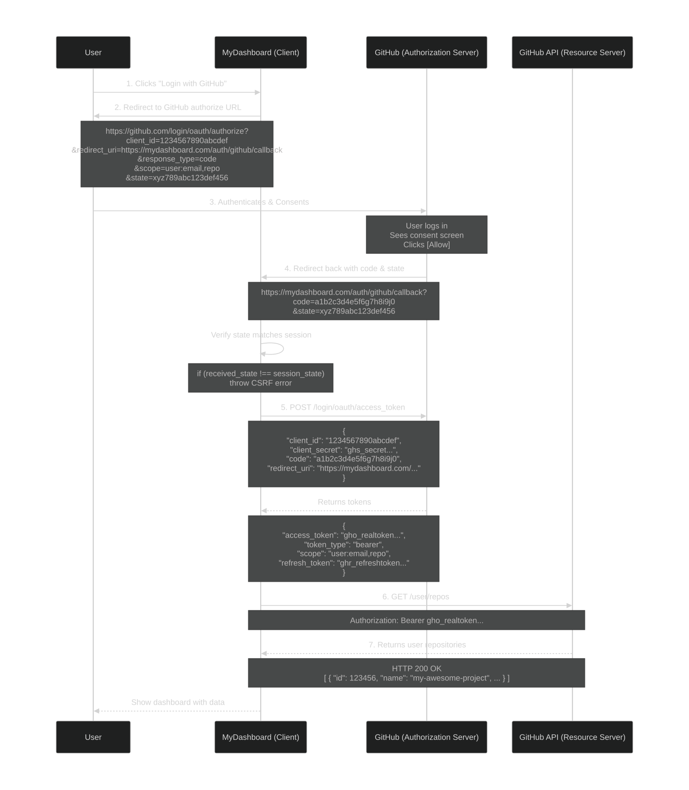

1. Getting client id and client secret: 
Let's imagine you have a web application called "MyDashboard" where you want users to be able to log in using their Google account. In this scenario:
- **The Client:** Your web application, "MyDashboard."
- **The Authorization Server:** Google's OAuth 2.0 server (available at https://accounts.google.com).
- **The Resource Server:** Google's APIs (for example, the https://www.googleapis.com/oauth2/v3/userinfo endpoint), which can provide user profile information.

To make this work, you would first register your application "MyDashboard" with Google. Through the Google Cloud Console, you would obtain the essential credentials:
- client_id: A public identifier for your app.
- client_secret: A confidential secret that verifies your app's identity to Google's server.

### PKCE
PKCE = Proof Key for Code Exchange
Pronounced: "pixy" (like the fairy)

In OAuth, the flow goes like this:
- Client sends user to /authorize
- User logs in, approves
- Auth server redirects back with an authorization code
- Client exchanges that code for tokens

The vulnerability: That authorization code travels through the browser (via redirect URL). On mobile/desktop apps, a malicious app on the same device can intercept the redirect and steal the code.
Once stolen, the attacker can exchange the code for tokens — game over.
PKCE fixes this by making the authorization code **useless to anyone who steals it**.

Instead of a client_secret, PKCE uses per-request secret:
- Generated fresh for every authorization request
- Never sent in the initial /authorize call (only its hash is)
- Verified at the /token exchange

1. Client generates a code_verifier
2. client derives a code_challenge `code_challenge = BASE64URL(SHA256(code_verifier))`
3. Client sends code_challenge in /authorize
4. User logs in → server returns authorization code
5. Client exchanges code + verifier for tokens

| Aspect | Client Secret | PKCE |
|---|---|---|
| Static? | Yes — same every time | No — fresh per request |
| Stored where? | Client (risky for public clients) | Never stored; generated on the fly |
| Sent in /authorize? | No | Only the hash (challenge) |
| Sent in /token? | Yes | Yes — the original verifier |
| Safe for public clients? | ❌ No | ✅ Yes |
| Replayable? | Yes, if leaked | No — one-time use |
| Required by OAuth 2.1? | No | ✅ Yes |
