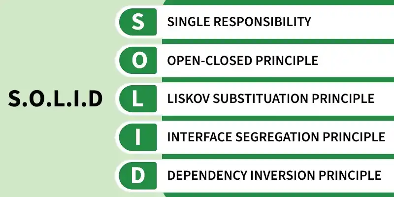

1. **Single Responsibility Principle:** Every class should have a single responsibility or single job or single purpose
2. **Open/Closed Principle:** Software entities (classes, modules, functions, etc.) should be open for extension, but closed for modification.. Make everything **configurable**
3. **Liskov's Substitution Principle** derived or child classes must be able to replace their base or parent classes
4. **Interface Segregation Principle** focusing on keeping interfaces specific and well-defined.
5. **Dependency Inversion Principle** High-level modules should not depend on low-level modules. Both should depend on abstractions [DIP suggests that classes should rely on abstractions (e.g., interfaces or abstract classes) rather than concrete implementatio]