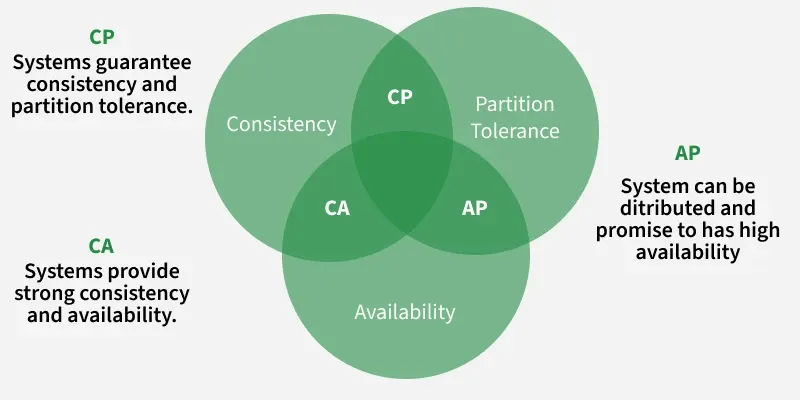

# System Design, Data Modeling & Software Architecture — Notes

A working reference covering the vocabulary, trade-offs, and comparisons that come up repeatedly when designing systems, modeling data, and choosing an architecture.

---

## 01. System Design

System design is the process of defining the architecture, components, modules, interfaces, and data for a system to satisfy specified requirements. It is usually split into two levels: **High-Level Design (HLD)**, which describes the overall architecture (components and how they talk to each other), and **Low-Level Design (LLD)**, which describes the internal logic of each component (classes, functions, schemas).

### 1.1 HLD vs LLD

| Aspect | High-Level Design | Low-Level Design |
|---|---|---|
| Focus | System architecture, components, data flow | Class design, algorithms, DB schema |
| Audience | Architects, stakeholders | Developers |
| Output | Block/architecture diagrams | UML, pseudocode, table schemas |
| Also called | Macro-level / system architecture | Micro-level / detailed design |

### 1.2 Non-functional requirements

Every design is judged against a standard set of "-ilities" — the qualities a correct system still needs in order to be a *good* system.

- **Scalability** — the ability to handle growing load by adding resources, without a redesign.
- **Availability** — the percentage of time a system is operational and responsive. Measured in "nines" (99.9% ≈ 8.7 hrs downtime/year, 99.99% ≈ 52 min/year).
- **Reliability** — the probability a system performs correctly over a given period; failure-free operation.
- **Fault tolerance** — the system keeps working (possibly in a degraded mode) even when a component fails.
- **Consistency** — every read reflects the latest write (or a well-defined, weaker guarantee — see CAP theorem, §1.7).
- **Latency vs throughput** — latency is the time for one request to complete; throughput is the number of requests handled per unit time. Optimizing one can hurt the other (batching improves throughput but adds latency).
- **Maintainability** — how easily the system can be understood, fixed, and extended.

### 1.3 Scaling & load balancing

**Vertical vs horizontal scaling**

- **Vertical scaling (scale-up)** — add more CPU/RAM/disk to one machine. Simple, no distribution logic, but has a hardware ceiling and is a single point of failure.
- **Horizontal scaling (scale-out)** — add more machines and distribute the load. Near-limitless growth, better fault tolerance, but introduces network, consistency, and coordination complexity.

**Load balancer algorithms**

- **Round robin** — requests rotate across servers in order; simple, assumes equal server capacity.
- **Least connections** — routes to the server with the fewest active connections; better for uneven request durations.
- **Weighted round robin** — like round robin, but stronger servers receive proportionally more requests.
- **IP / consistent hash** — routes a given client (or key) to the same server, useful for session affinity or cache locality.

> **Key point:** A load balancer can sit at Layer 4 (TCP/UDP — fast, routes on IP/port) or Layer 7 (HTTP — slower, but can route on URL path, headers, or cookies).

### 1.4 Caching

Caching stores a copy of frequently accessed data in a faster-access layer (in-memory, CDN edge, browser) to reduce latency and load on the primary data store.

**Cache-writing strategies**

- **Cache-aside (lazy loading)** — application checks cache first; on a miss, reads from DB and populates the cache. Simple and resilient to cache failure, but the first request always pays the miss cost.
- **Write-through** — every write goes to the cache and the DB together. Cache stays consistent, but write latency increases.
- **Write-back (write-behind)** — write goes to the cache first and is flushed to the DB asynchronously. Fast writes, but risk of data loss if the cache crashes before flushing.
- **Write-around** — writes go directly to the DB, bypassing the cache; avoids filling the cache with data that may not be re-read.

**Eviction policies**

- **LRU (Least Recently Used)** — evicts the item that hasn't been accessed for the longest time.
- **LFU (Least Frequently Used)** — evicts the item accessed the fewest number of times.
- **FIFO** — evicts the oldest inserted item, regardless of usage.

### 1.5 SQL vs NoSQL

| Aspect | SQL (RDBMS) | NoSQL |
|---|---|---|
| Schema | Fixed, defined up front | Dynamic / schema-less |
| Scaling | Vertical (primarily) | Horizontal (built for it) |
| Consistency | Strong (ACID) | Often eventual (BASE) (Basically Available, Soft State (state can change over time), and Eventual Consistency( consistency can achirved later)) |
| Relationships | Joins, foreign keys | Embedding or app-level joins |
| Best for | Structured data, transactions | High volume, flexible/rapidly changing data |
| Examples | PostgreSQL, MySQL, Oracle | MongoDB, Cassandra, Redis, Neo4j |

**NoSQL families**

- **Key-value** — simplest model, O(1) lookup by key. e.g. Redis, DynamoDB.
- **Document** — stores semi-structured documents (JSON/BSON), each self-contained. e.g. MongoDB.
- **Column-family / wide-column** — optimized for writing and scanning large volumes of column data. e.g. Cassandra, HBase.
- **Graph** — stores nodes and edges for relationship-heavy queries. e.g. Neo4j.

### 1.6 Replication & sharding

**Replication**

- **Master-slave (primary-replica)** — writes go to the primary; replicas serve reads. Improves read throughput and provides a failover copy, but replicas can lag (replication lag).
- **Master-master** — multiple nodes accept writes; needs conflict resolution, but removes a single write bottleneck.
- **Synchronous vs asynchronous** — sync replication waits for replicas to confirm (safer, slower); async doesn't wait (faster, risk of data loss on failure).

**Sharding (horizontal partitioning)**

Splits one large dataset across multiple database instances (shards), each holding a subset of rows.

- **Range-based** — partition by a value range (e.g. user IDs 1–1M on shard A). Simple, but can create hot shards.
- **Hash-based** — apply a hash function to the shard key to pick a shard. Spreads load evenly, but range queries become expensive.
- **Directory-based** — a lookup service maps keys to shards. Flexible (easy to rebalance), but the lookup service is a new dependency/bottleneck.

> **Example:** A social app shards users by `hash(user_id) % N` so profile writes/reads for any one user always land on the same shard, keeping user-scoped queries fast.

**Vertical partitioning**, by contrast, splits a table by columns rather than rows — e.g. moving rarely-used large text/blob columns into a separate table to keep the hot table small.

### 1.7 CAP theorem & PACELC
**distributed system:** a group of independent computers, called nodes, that communicate over a network to work together as a single unified system
In a distributed system, the **CAP theorem** states you can only guarantee two of the following three at once, during a network partition:

- **Consistency (C)** — every read gets the most recent write or an error.
- **Availability (A)** — every request receives a (non-error) response, without a guarantee it's the latest write.
- **Partition tolerance (P)** — the system keeps operating despite network failures between nodes.

> **Key point:** Because networks do fail, partition tolerance is effectively mandatory for a distributed system — the real-world choice is between **CP** (consistent, may reject requests during a partition — e.g. HBase, MongoDB in default config) and **AP** (available, may serve stale data — e.g. Cassandra, DynamoDB).

**PACELC** extends CAP: *if Partitioned, choose Availability or Consistency; Else (normal operation), choose Latency or Consistency* — acknowledging that trade-offs exist even when there's no partition.

### 1.8 Consistent hashing

A hashing technique that minimizes data movement when nodes are added or removed from a distributed cache/store.

- Both servers and keys are hashed onto a fixed circular space (a "hash ring").
- A key is assigned to the first server found moving clockwise from the key's position.
- Removing/adding one server only remaps the keys between it and its neighbor — not the entire keyspace, unlike plain `hash(key) % N` where changing N remaps almost everything.
- **Virtual nodes** (multiple points per physical server on the ring) are used to spread load evenly and avoid hot spots.

> **Example:** Used by Amazon DynamoDB, Cassandra, and CDN request routing to distribute keys across nodes while keeping rebalancing cheap.

### 1.9 Message queues & pub-sub

Asynchronous messaging decouples producers from consumers, smooths traffic spikes, and enables retry/replay.

- **Point-to-point queue** — one message is consumed by exactly one consumer (e.g. RabbitMQ, SQS). Good for task distribution/work queues.
- **Publish–subscribe** — one message is delivered to every subscriber of a topic (e.g. Kafka, SNS). Good for event broadcasting.
- **Kafka** specifically retains an ordered, replayable log per partition — useful for event sourcing and stream processing, not just delivery.

> **Key point:** Queues trade immediate consistency for resilience: a slow or failing downstream service no longer blocks the caller, and messages can be retried or replayed instead of lost.

### 1.10 CDN & proxies

- **CDN (Content Delivery Network)** — caches static content (images, JS, video) at edge servers geographically close to users, cutting latency and origin load.
- **Forward proxy** — sits in front of clients, hiding client identity from the server (e.g. corporate proxy, VPN).
- **Reverse proxy** — sits in front of servers, hiding server identity from clients; also handles load balancing, SSL termination, and caching (e.g. Nginx, HAProxy).

### 1.11 Rate limiting

- **Token bucket** — a bucket refills with tokens at a fixed rate; each request consumes one token. Allows short bursts up to the bucket size.
- **Leaky bucket** — requests queue up and are processed (leaked) at a constant rate, smoothing out bursts entirely.
- **Fixed window counter** — counts requests in a fixed time window (e.g. per minute); simple, but allows a burst at window boundaries.
- **Sliding window log/counter** — tracks requests over a rolling window, avoiding the boundary-burst problem at the cost of more memory/computation.

### 1.12 Common failure modes

- **Single point of failure (SPOF)** — any component whose failure takes down the whole system; fix via redundancy.
- **Hot spot / hot partition** — uneven load on one shard/key due to a bad partition key or a viral item; fix via better key design, or splitting the hot key further.
- **Cascading failure** — one overloaded service's slow responses back up callers, which then also become slow/overloaded; fix via timeouts, circuit breakers, bulkheads (isolate resource pools per dependency), and load shedding.
- **Retry storms** — naive retries on failure amplify load on an already-struggling downstream; fix via exponential backoff + jitter, and capping retry attempts.
- **Split brain** — a network partition causes two nodes to both believe they're the leader; fix via consensus protocols (Raft/Paxos) requiring a quorum before accepting writes.

### 1.13 A framework for system design interviews

1. **Clarify requirements** — functional (what it does) and non-functional (scale, latency, consistency needs).
2. **Estimate scale** — back-of-envelope math for QPS, storage, and bandwidth.
3. **Define the API** — the contract between client and system.
4. **High-level design** — draw the major components and how data flows between them.
5. **Deep-dive** — pick 1–2 components and detail the data model, algorithm, or scaling technique.
6. **Identify bottlenecks** — single points of failure, hot spots, and how to mitigate them.

---

## 02. Data Modeling

Data modeling is the process of defining how data is structured, stored, and related, before and independent of how it's queried by any one application. A good model reduces redundancy, keeps data consistent, and makes the system's rules explicit rather than implicit in application code.

### 2.1 What data modeling is, and why it matters

A data model is a blueprint of the data: what entities exist, what attributes describe them, and how they relate. Modeling well up front avoids anomalies later — inconsistent data, wasted storage, and slow or incorrect queries.

### 2.2 The three levels of schema

| Level | Describes | Audience |
|---|---|---|
| **Conceptual** | What entities exist and how they relate — no attributes or types | Business stakeholders |
| **Logical** | Entities, attributes, relationships, keys — still DB-agnostic | Data architects / analysts |
| **Physical** | Actual tables, columns, data types, indexes for a specific DB | Database engineers |

### 2.3 The Entity-Relationship (ER) model

- **Entity** — a real-world object or concept represented in the data (e.g. `Student`, `Order`).
- **Attribute** — a property of an entity. Can be *simple* (atomic), *composite* (splits further, e.g. Address → Street, City), *derived* (computed, e.g. Age from DOB), or *multi-valued* (e.g. PhoneNumbers).
- **Relationship** — an association between entities, with a cardinality:
  - **One-to-one (1:1)** — a Person has one Passport.
  - **One-to-many (1:N)** — a Customer places many Orders.
  - **Many-to-many (M:N)** — Students enroll in many Courses, each Course has many Students — implemented via a junction/bridge table.

**Keys**

- **Candidate key** — any column (or set of columns) that could uniquely identify a row.
- **Primary key** — the candidate key chosen to uniquely identify rows; cannot be null.
- **Composite key** — a primary key made of more than one column.
- **Foreign key** — a column referencing another table's primary key, enforcing referential integrity.

### 2.4 Normalization

Normalization organizes columns and tables to minimize data redundancy and avoid update/insert/delete anomalies, by progressively applying a set of rules ("normal forms").
An insertion anomaly occurs when we cannot insert data into a table without adding unnecessary or unrelated data.

A deletion anomaly occurs when removing some data unintentionally deletes important related data.

An update anomaly occurs when updating a single piece of data requires multiple changes, leading to inconsistency.

| Form | Rule | Eliminates |
|---|---|---|
| **1NF** | Every column holds atomic (indivisible) values; no repeating groups | Multi-valued columns |
| **2NF** | 1NF + every non-key column depends on the *whole* primary key | Partial dependency (composite keys) |
| **3NF** | 2NF + no non-key column depends on another non-key column | Transitive dependency |
| **BCNF** | Every determinant (thing another column depends on) is a candidate key | Remaining anomalies 3NF misses |

> **Example — removing a transitive dependency (3NF):** `Employee(emp_id, dept_id, dept_name)` stores `dept_name` redundantly on every employee row, and it depends on `dept_id`, not directly on `emp_id`. Splitting into `Employee(emp_id, dept_id)` and `Department(dept_id, dept_name)` removes the redundancy and the anomaly (renaming a department no longer requires updating every employee row).

### 2.5 Denormalization

Denormalization deliberately reintroduces redundancy — duplicating or precomputing data — to reduce the number of joins a read-heavy query needs, trading storage and write-complexity for read speed. It is a conscious performance decision made *after* understanding the normalized model, not a shortcut around it.

> **Key point:** Normalize by default for correctness; denormalize selectively where profiling shows a read path is join-heavy and read far more often than it's written.

### 2.6 Star schema vs snowflake schema

Used in data warehousing / analytics, where a central **fact table** (measurable events, e.g. sales) links to surrounding **dimension tables** (descriptive context, e.g. product, customer, time).

| Aspect | Star schema | Snowflake schema |
|---|---|---|
| Dimension tables | Denormalized (flat) | Normalized into sub-dimensions |
| Joins per query | Fewer | More |
| Storage | More redundant | More space-efficient |
| Query speed | Faster | Slower, but easier to maintain |

### 2.7 Modeling for NoSQL

Relational modeling starts from the data's structure; NoSQL modeling starts from the **access pattern** — design the schema around the queries the application actually runs.

- **Embedding** — nest related data inside the same document (e.g. an Order embeds its line items). Fast single-read access, but can duplicate data and grow documents unboundedly.
- **Referencing** — store an ID and look the related document up separately, similar to a foreign key. Keeps documents small, but requires extra reads (app-level joins).
- Rule of thumb: embed data that is always read together and rarely changes independently; reference data that is large, shared across many parents, or updated on its own.

---

## 03. Software Architecture

Software architecture is the set of high-level structural decisions about a system — how it is decomposed into components, how those components communicate, and what constraints those decisions place on everything built afterward. Where "system design" often centers on infrastructure and scale, software architecture centers on how the codebase itself is organized.

### 3.1 Architecture vs design

- **Architecture** — the big, expensive-to-change decisions: what the major components are, and how they're allowed to talk to each other.
- **(Low-level) design** — the decisions within a component: class structure, function boundaries, which patterns to apply.
- A useful test: if reversing a decision would require rewriting a large part of the system, it's architecture; if it's confined to one module, it's design.

### 3.2 Common architectural styles

- **Layered / N-tier** — organizes the system into horizontal layers (presentation → business logic → data access), where each layer only talks to the one below it. Easy to reason about and test in isolation, but a request can pay the cost of passing through every layer.
- **Client–server** — clients request services from a central server. The foundational model behind most web and mobile apps.
- **Monolithic** — the entire application is a single deployable unit. Simple to develop, test, and deploy early on; harder to scale or release independently as the codebase grows.
- **Microservices** — the application is split into small, independently deployable services, each owning its own data, communicating over the network (often HTTP/gRPC or messaging).
- **Service-Oriented Architecture (SOA)** — a precursor to microservices; coarser-grained services, typically integrated through an enterprise service bus (ESB).
- **Event-driven** — components communicate by emitting and reacting to events through a broker, rather than calling each other directly. Enables loose coupling and async processing, at the cost of harder-to-trace flows.
- **Serverless / FaaS** — code runs in stateless functions triggered by events, with the cloud provider managing scaling and infrastructure.
- **Peer-to-peer** — nodes act as both client and server, sharing load and resources directly (e.g. BitTorrent, blockchain networks).

### 3.3 Monolith vs microservices

| Aspect | Monolithic | Microservices |
|---|---|---|
| Deployment | Single unit | Independent per service |
| Scaling | Scale the whole app | Scale only the services that need it |
| Development speed (early) | Fast — one codebase | Slower — distributed system overhead |
| Fault isolation | One failure can affect the whole app | A failing service can be isolated |
| Operational complexity | Low | High — needs service discovery, orchestration, monitoring |
| Data consistency | Easy — one database, real transactions | Hard — distributed transactions, eventual consistency |

### 3.4 SOLID principles

- **S — Single Responsibility** — a class/module should have exactly one reason to change.
- **O — Open/Closed** — open for extension, closed for modification: add new behavior without editing existing, tested code.
- **L — Liskov Substitution** — a subtype must be usable anywhere its base type is expected, without breaking correctness.
- **I — Interface Segregation** — prefer several small, specific interfaces over one large general-purpose one, so clients don't depend on methods they don't use.
- **D — Dependency Inversion** — depend on abstractions, not concrete implementations; high-level modules shouldn't depend on low-level details.

### 3.5 Design pattern families (GoF)

| Family | Solves | Examples |
|---|---|---|
| **Creational** | How objects are constructed | Singleton, Factory, Builder |
| **Structural** | How objects/classes are composed | Adapter, Decorator, Facade |
| **Behavioral** | How objects interact & communicate | Observer, Strategy, Command |

### 3.6 Choosing an architecture

1. **Start simple.** A monolith is usually the right first architecture — it's faster to build and easier to change while requirements are still unclear.
2. **Split along real boundaries.** Move to microservices when distinct parts of the system need to scale, deploy, or fail independently — not by default.
3. **Match consistency needs.** Systems that need strong transactional guarantees (banking, inventory) push toward fewer, more consolidated services; systems tolerant of eventual consistency can split further.
4. **Account for team size.** Conway's Law: system structure tends to mirror communication structure — many small independent teams work better with many small independent services, and vice versa.

---

*End of notes — 3 modules / 30 topics.*
