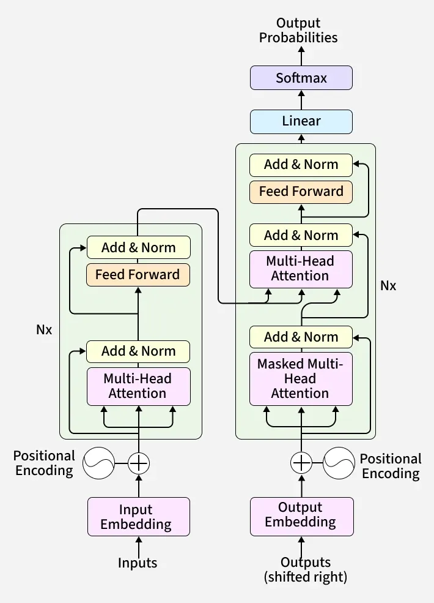

# LLM (Large Language Model) Architecture

> Notes written in a GeeksforGeeks-style tutorial format — simple definitions first, then deeper detail, tables, formulas, and code examples. Builds on `neural_network.md` (Transformer Networks) and `17.ai_agents.md`.

---

## What is a Large Language Model (LLM)?

A **Large Language Model (LLM)** is a deep learning model — built on the **Transformer architecture** — trained on massive amounts of text data to understand and generate human-like language. "Large" refers to two things: the **huge number of parameters** (billions to trillions of weights) and the **huge scale of training data** (trillions of tokens/words).

In simple words: an LLM is a neural network that has learned the statistical patterns of language so well that, given some input text, it can predict what text should come next — and by doing this repeatedly, one token at a time, it can hold conversations, answer questions, write code, summarize documents, and more.

Examples: GPT (OpenAI), Claude (Anthropic), Gemini (Google), Llama (Meta).

---

## The Foundation: Transformer Architecture

Almost all modern LLMs are built on the **Transformer** architecture, introduced in the 2017 paper *"Attention Is All You Need"*. Before Transformers, sequence models like **RNNs** and **LSTMs** (see `neural_network.md`) processed text **one word at a time, in order** — which made them slow to train and bad at capturing very long-range dependencies.

The Transformer's key innovation is the **Self-Attention Mechanism**, which allows the model to look at **all words in a sequence simultaneously** and directly learn how every word relates to every other word — regardless of distance between them — while also being highly parallelizable on GPUs.

```
Input Text → Tokenization → Embeddings + Positional Encoding
           → [ Transformer Blocks × N ]  (Self-Attention + Feed-Forward)
           → Output Probabilities → Next Token
```

---

## Step 1: Tokenization

Before any text reaches the model, it must be converted into numbers. **Tokenization** splits raw text into smaller units called **tokens** — which may be whole words, sub-words, or even individual characters — and maps each token to a unique integer ID from a fixed **vocabulary**.

| Tokenization Type | Description | Example |
|---|---|---|
| **Word-level** | Each word is a token | `"playing"` → 1 token |
| **Character-level** | Each character is a token | `"playing"` → 7 tokens |
| **Subword-level (most common)** | Common words stay whole; rare words are split into meaningful chunks | `"playing"` → `["play", "ing"]` |

Most modern LLMs use **subword tokenization** algorithms like **Byte Pair Encoding (BPE)** or **SentencePiece**, because they strike a balance: a manageable vocabulary size, while still being able to represent any word (even unseen ones) by breaking it into known sub-parts.

```python
# Conceptual example using Hugging Face tokenizers
from transformers import AutoTokenizer

tokenizer = AutoTokenizer.from_pretrained("gpt2")
tokens = tokenizer.encode("Neural networks are powerful")
print(tokens)   # e.g. [8199, 3781, 389, 3665]
```

---

## Step 2: Embeddings

Each token ID is converted into a dense vector of numbers (e.g., 768 or 4096 dimensions) called an **embedding**, via a learned **Embedding Layer** — essentially a lookup table where each row corresponds to one vocabulary token.

**Why embeddings?** Raw token IDs (like `42` vs `43`) carry no semantic meaning — they're arbitrary. Embeddings place words in a continuous vector space where **semantically similar words end up close together** (e.g., the vectors for "king" and "queen" are closer to each other than to "banana"). This is what allows the model to generalize based on meaning rather than exact word matches.

```
Token ID: 8199 ("Neural")  →  [0.12, -0.45, 0.88, ..., 0.03]   (e.g., 768 numbers)
```

---

## Step 3: Positional Encoding

Unlike RNNs, the Self-Attention mechanism has **no built-in sense of word order** — it looks at all tokens at once, in parallel, so by itself it can't tell "dog bites man" from "man bites dog". To fix this, a **Positional Encoding** vector (encoding the token's position in the sequence, e.g., using sine/cosine functions of different frequencies, or a learned position embedding) is added to each token's embedding before it enters the Transformer blocks.

```
Final Input Vector = Token Embedding + Positional Encoding
```

---

## Step 4: The Self-Attention Mechanism

**Self-Attention** is the core mechanism that lets each token "look at" every other token in the sequence and decide **how much attention to pay to it** when building its own contextual representation.

### Intuition

Consider the sentence: *"The animal didn't cross the street because **it** was too tired."* To understand what "it" refers to, a model needs to look back at "animal" — not the nearest word. Self-attention lets the model learn to directly connect "it" to "animal" with a high attention weight, regardless of the distance between them.

### The Query, Key, Value (Q, K, V) Mechanism

For every token, the model computes three vectors by multiplying the token's embedding with three learned weight matrices:

| Vector | Role | Analogy |
|---|---|---|
| **Query (Q)** | "What am I looking for?" | The search term you type |
| **Key (K)** | "What do I contain?" | The keywords/tags on each document |
| **Value (V)** | "What information do I actually carry?" | The content of each document |

### The Formula

```
Attention(Q, K, V) = softmax( (Q · K^T) / √d_k ) · V
```

**Step by step:**
1. `Q · K^T` — compute a similarity score between every Query and every Key (i.e., how relevant is every other token to this token).
2. `/ √d_k` — scale down the scores (where `d_k` is the dimension of the key vectors) to keep gradients stable during training.
3. `softmax(...)` — convert scores into probabilities (attention weights) that sum to 1, so the model expresses "how much to attend to each token" as a distribution.
4. `· V` — take a weighted sum of all Value vectors using those attention weights, producing the final contextualized output for that token.

```python
import numpy as np

def self_attention(Q, K, V):
    d_k = Q.shape[-1]
    scores = Q @ K.T / np.sqrt(d_k)
    weights = np.exp(scores) / np.exp(scores).sum(axis=-1, keepdims=True)  # softmax
    return weights @ V
```

### Multi-Head Attention

Instead of computing a single attention pass, the Transformer runs **multiple attention "heads" in parallel**, each with its own learned Q/K/V weight matrices. Each head can learn to focus on a **different type of relationship** (e.g., one head might track grammatical structure, another might track long-range topic references). The outputs of all heads are concatenated and passed through a final linear layer.

```
MultiHead(Q, K, V) = Concat(head_1, head_2, ..., head_h) · W_O
```

**Why multiple heads instead of one big one?** It lets the model attend to information from **different representation subspaces simultaneously**, capturing richer relationships than a single attention pass could.

### Causal (Masked) Self-Attention

When **generating** text, a token must only be allowed to attend to **previous tokens**, not future ones (otherwise it would be "cheating" by looking at the answer). This is enforced using a **causal mask**, which sets attention scores for future positions to `-∞` before the softmax step, so their attention weight becomes effectively 0.

---

## Step 5: Feed-Forward Network (FFN)

After the self-attention step, each token's representation is passed independently through a small **Feed-Forward Neural Network** (typically two `Dense` layers with a non-linear activation like **GELU** in between). This adds additional representational capacity and non-linearity beyond what attention alone provides.

```
FFN(x) = activation(x · W1 + b1) · W2 + b2
```

---

## Step 6: Residual Connections(Add) and Layer Normalization(NOrm)

Each sub-layer (Self-Attention and Feed-Forward) in a Transformer block is wrapped with two important stabilization techniques:

| Technique | What it Does | Why it Matters |
|---|---|---|
| **Residual (Skip) Connection** | Adds the sub-layer's input back to its output: `output = x + SubLayer(x)` | Prevents vanishing gradients in very deep networks, allows gradients to flow directly through the network |
| **Layer Normalization** | Normalizes activations across the feature dimension for each token | Stabilizes and speeds up training |

```
x = x + SelfAttention(LayerNorm(x))
x = x + FeedForward(LayerNorm(x))
```

*(This "Norm before sub-layer" ordering is called Pre-LN, used by most modern LLMs like GPT-2 onward, for more stable training than the original Post-LN design.)*

---

## The Full Transformer Block

Stacking all the pieces above gives one **Transformer Block**. A full LLM is simply **N of these blocks stacked on top of each other** (e.g., GPT-3 has 96 layers), with the output of one block feeding into the next.

```
        ┌─────────────────────────────┐
        │   Add & LayerNorm            │
        │        ↑                     │
        │   Feed-Forward Network       │
        │        ↑                     │
        │   Add & LayerNorm            │
        │        ↑                     │
        │   Multi-Head Self-Attention  │
        │        ↑                     │
Input ──┴─────────────────────────────┘── Output
              (repeated N times)
```

---

## Encoder vs Decoder vs Encoder-Decoder Architectures

### What is an Encoder?
- **Role:** Reads and analyzes the full input sequence all at once.
- **Mechanism:** Uses bidirectional self-attention so every word can look at every other word around it to build rich contextual meaning.
- **Output:** Produces a high-dimensional vector representation (embeddings) of the input data.
Example Use Case: Text classification or sentiment analysis (e.g., BERT).

### What is a Decoder?
- **Role:** Generates new tokens one at a time (autoregressively).
- **Mechanism:** Uses masked (causal) self-attention to block future words so the model cannot "cheat" by looking ahead.
- **Output:** Produces sequential output text, word by word.
Example Use Case: Open-ended text generation and chat (e.g., GPT models).

### What is an Encoder-Decoder?
- **Role:** Translates or converts an entire input sequence into a completely new output sequence.
- **Mechanism:** Combines an encoder stack to process the input and a decoder stack equipped with cross-attention (or encoder-decoder attention) to focus on the encoder's output while writing.
Example Use Case: Machine translation (e.g., English to French) or text summarization (e.g., T5)

The original Transformer paper had two halves — an **Encoder** and a **Decoder** — but modern LLMs typically use only one:

| Architecture | Attention Type | Example Models | Best For |
|---|---|---|---|
| **Encoder-only** | Bidirectional (sees full context both directions) | BERT | Understanding tasks — classification, embeddings, search |
| **Decoder-only** | Causal/masked (only sees previous tokens) | GPT, Claude, Llama | Text generation — chat, completion, most modern LLMs |
| **Encoder-Decoder** | Encoder is bidirectional, Decoder is causal(output depends only on past and present input values) + attends to encoder output | T5, original Transformer, translation models | Sequence-to-sequence tasks — translation, summarization |

Most of today's popular chat-based LLMs (GPT-4, Claude, Llama, Gemini) are **decoder-only** models — they simply predict the next token, one at a time, using only leftward context.

---

## Step 7: Output Layer — From Vectors Back to Words

After passing through all Transformer blocks, the final token representation is passed through:

1. A final **Linear layer** that projects it back to the size of the vocabulary (e.g., 50,000+ dimensions — one score(logits)per possible token).
2. A **Softmax** function that converts these scores into a probability distribution over the entire vocabulary.
3. A **sampling strategy** picks the next token from this distribution.

Linear Layer = "Give every possible token a score(Logits)."
Logits are already learned weights from hidden layer for each possible token.
Given everything I've seen so far, how strongly do I prefer this token as the next token        
Softmax = "Turn those scores into probabilities."
Sampling = "Choose which token actually comes next."

### Sampling Strategies (Decoding Methods)

| Strategy | Description |
|---|---|
| **Greedy Decoding** | Always picks the single highest-probability token — deterministic, but can be repetitive/dull |
| **Temperature Sampling** | Scales the probability distribution before sampling; low temperature (e.g., 0.2) → more focused/deterministic, high temperature (e.g., 1.2) → more random/creative |
| **Top-k Sampling** | Randomly samples only from the `k` most likely next tokens |
| **Top-p (Nucleus) Sampling** | Randomly samples from the smallest set of tokens whose cumulative probability exceeds `p` (e.g., 0.9) — adapts the candidate pool size dynamically |

Once a token is chosen, it is appended to the input sequence, and the **entire process repeats** to generate the next token — this is why LLM text generation is described as **autoregressive**.

---

## How LLMs Are Trained

### 1. Pre-training

The model is trained on a massive, broad corpus of text (books, websites, code, etc.) using a **self-supervised** objective — typically **next-token prediction**: given all previous tokens, predict the next one, and use the difference from the actual next token as the loss (Cross-Entropy Loss — see `neural_network.md`). No manual labeling is required, since the "label" for each position is just the actual next word in the text itself. This stage teaches the model grammar, facts, reasoning patterns, and general world knowledge — and is by far the most computationally expensive stage.

### 2. Fine-tuning / Supervised Fine-Tuning (SFT)

The pre-trained ("base") model is further trained on a smaller, curated dataset of high-quality **instruction–response pairs**, teaching it to follow instructions and produce helpful, well-formatted answers rather than just continuing text in a generic way.

### 3. Reinforcement Learning from Human Feedback (RLHF)

Human reviewers rank multiple model responses to the same prompt by quality; a **reward model** is trained to predict these human preferences, and the LLM is then further optimized (commonly via an algorithm like **PPO**, or newer alternatives like **DPO** — Direct Preference Optimization) to produce responses that score higher on this learned reward model. This stage is what makes models more helpful, honest, and aligned with human preferences/safety expectations, beyond raw next-token prediction.

```
Pre-training (huge, generic corpus)
        │
        ▼
Supervised Fine-Tuning (instruction–response pairs)
        │
        ▼
RLHF / Preference Optimization (human-ranked responses)
        │
        ▼
   Deployed Assistant Model
```

---

## Key Architectural Concepts in Modern LLMs

### Context Window

The **context window** is the maximum number of tokens (input + output combined) a model can process/attend to at once. It's directly tied to the self-attention mechanism, since attention computes relationships between every pair of tokens in the window — this is also why context length matters so much for cost/speed (see complexity note below).

### KV Cache

During autoregressive generation, recomputing Key and Value vectors for **all previous tokens** at every single new-token step would be extremely wasteful. Instead, models cache the previously computed K and V vectors (**KV Cache**) and only compute Q/K/V for the newest token, massively speeding up inference for long generations.

### Computational Complexity of Attention

Standard self-attention computes relationships between **every pair of tokens**, giving it `O(n²)` time and memory complexity with respect to sequence length `n`. This is the main reason very long context windows are expensive — doubling the context length roughly quadruples the attention computation. Many research techniques (sparse attention, sliding-window attention, linear attention variants) exist specifically to reduce this cost for long-context models.

### Mixture of Experts (MoE)

Instead of every token passing through one dense Feed-Forward Network, an **MoE** layer has many parallel "expert" FFNs, plus a small **router/gating network** that selects only a few experts (e.g., 2 out of 8) to process each token. This allows the total parameter count to scale up massively while keeping the **compute cost per token** roughly constant, since only a fraction of the model's parameters are actually used for any given token.

### Scaling Laws

Empirical research (e.g., the "Chinchilla" and "Kaplan" scaling laws) has shown that an LLM's performance improves **predictably and smoothly** as a power-law function of three things: **model size (parameters)**, **dataset size (tokens)**, and **compute (FLOPs)** used for training — as long as they're scaled together in roughly the right proportions. This is why frontier LLMs keep growing in both parameter count and training data volume.

---

## What Do "Parameters" Actually Mean? (Why Every LLM Says "X Billion Parameters")

A **parameter** is just one learned number (a weight or bias) inside the model's matrices — the values that get adjusted during training via backpropagation. When a model is advertised as "7B" or "70B", that number is simply the **total count of these learned weights** added up across every matrix in the network. It is *not* a separate marketing figure — it's derived directly from the architecture's shape (layers, hidden size, vocab size, etc.).

### Where the parameters actually live

For a decoder-only Transformer (GPT-style), almost all parameters come from four places, repeated across every block:

| Component | Weight Matrices | Approx. Parameter Count |
|---|---|---|
| **Token Embedding** | Vocab → hidden size lookup table | `vocab_size × d_model` |
| **Self-Attention (per layer)** | `W_Q, W_K, W_V, W_O` projection matrices | `4 × d_model²` |
| **Feed-Forward Network (per layer)** | `W1` (expand) and `W2` (project back), usually 4× wider | `8 × d_model²` |
| **Layer Norms / Biases** | Small vectors | Negligible (~thousands) |
| **Output (Unembedding) Layer** | Hidden size → vocab (often *tied* / shared with the input embedding) | `vocab_size × d_model` (often reused, adds 0 extra) |

Since attention + FFN together cost roughly `12 × d_model²` per layer, a simple back-of-envelope formula for a decoder-only model is:

```
Total Parameters ≈ (vocab_size × d_model)              # embedding (+ output, if tied)
                  + N_layers × 12 × d_model²            # attention + FFN per block
```

### Worked example

Take a GPT-3-like config: `d_model = 12288`, `N_layers = 96`, `vocab_size ≈ 50,000`.

```
Per-layer params ≈ 12 × 12288²        ≈ 1.81 billion
All layers       ≈ 96 × 1.81B         ≈ 174 billion   (dominant term)
Embedding        ≈ 50,000 × 12,288    ≈ 0.6 billion
                                       ─────────────
Total                                 ≈ 175 billion   ✅ matches GPT-3's known 175B
```

**Key takeaway:** parameter count grows roughly with `N_layers × d_model²` — so doubling the hidden size (`d_model`) roughly **quadruples** the parameter count, while doubling the number of layers only **doubles** it. This is why widening a model is far more expensive, parameter-wise, than deepening it.

### Why models get called "10B", "70B", etc.

It's simply shorthand for the sum above, rounded — e.g. Llama 3 8B has `d_model = 4096`, 32 layers, ≈50K-ish vocab → sums to ~8 billion learned weights. Bigger numbers roughly (per scaling laws) mean more capacity to store patterns/knowledge from training data — but only if paired with enough training tokens (see **Scaling Laws** above); a huge parameter count trained on too little data underperforms a smaller, well-trained model.

### Rough scale reference

| Model | Approx. Parameters | Notes |
|---|---|---|
| GPT-2 (large) | 1.5B | Early open decoder-only LLM |
| Llama 3 8B | 8B | Popular small open-weight model |
| Llama 3 70B | 70B | Larger open-weight model |
| GPT-3 | 175B | Dense (all params used per token) |
| Mixtral 8x7B (MoE) | 46.7B total, ~12.9B active per token | Only a few "experts" activate per token (see **Mixture of Experts** above) |
| GPT-4 / Claude / Gemini frontier models | Undisclosed (widely estimated in the hundreds of billions to ~1T+, likely MoE) | Exact counts not publicly confirmed by vendors |

*Note on MoE models:* for a Mixture-of-Experts model, "10B parameters" can be misleading — the **total** parameter count (all experts combined, what's stored on disk/in memory) can be much larger than the **active** parameter count (what's actually used to compute a single token), since only a few experts are routed to per token.

---

## Comparison: Traditional NN/RNN vs Transformer-based LLM

| | RNN / LSTM | Transformer-based LLM |
|---|---|---|
| **Processing** | Sequential, one token at a time | Parallel — all tokens processed at once |
| **Long-range dependencies** | Weak (vanishing gradients over long sequences) | Strong (direct attention between any two tokens) |
| **Training speed** | Slow (can't parallelize across sequence steps) | Fast (highly parallelizable on GPUs) |
| **Core mechanism** | Hidden state passed step to step | Self-Attention across the whole sequence |

---

## Applications of LLMs

| Domain | Example Use Case |
|---|---|
| Conversational AI | Chatbots, virtual assistants (Claude, ChatGPT) |
| Code Generation | Auto-completing/writing/debugging code |
| Summarization | Condensing long documents into key points |
| Translation | Converting text between languages |
| Retrieval-Augmented Generation (RAG) | Answering questions grounded in external documents (see `15.RAG.md`) |
| Agents | LLMs as the reasoning engine driving tool use and multi-step tasks (see `17.ai_agents.md`) |

---

## Frequently Asked Questions (FAQs)

**Q1. Why is self-attention better than RNNs for language modeling?**
Self-attention directly connects any two tokens in a single step, regardless of distance, and processes the whole sequence in parallel — giving both better long-range understanding and much faster training compared to RNNs, which process tokens sequentially and struggle with long-range dependencies due to vanishing gradients (see `neural_network.md`).

**Q2. What is the difference between a "base model" and a "chat/instruct model"?**
A **base model** is the raw output of pre-training — it's good at continuing text but isn't tuned to follow instructions or converse. A **chat/instruct model** is the same base model after Supervised Fine-Tuning and RLHF, specifically trained to follow instructions and hold helpful, safe conversations.

**Q3. Why do LLMs sometimes "hallucinate" (state incorrect facts confidently)?**
Because an LLM is fundamentally a next-token predictor trained to produce statistically plausible text, not a database of verified facts — it can generate fluent, confident-sounding text that is factually wrong, especially for knowledge outside its training data or that it never reliably learned. Techniques like RAG (grounding answers in retrieved documents) help mitigate this.

**Q4. What's the difference between parameters and tokens?**
**Parameters** are the learned weights inside the model (its "knowledge capacity"), fixed after training. **Tokens** are the units of text the model reads/writes at inference and training time — a prompt's length is measured in tokens, not words or characters.

**Q5. Why do decoder-only models dominate modern chat LLMs over encoder-decoder models?**
Decoder-only models are simpler (one stack instead of two), scale well, and turn out to be highly effective at general-purpose generation when trained at large scale — a single unified architecture can handle understanding and generation together via next-token prediction, avoiding the need for task-specific encoder-decoder setups.
