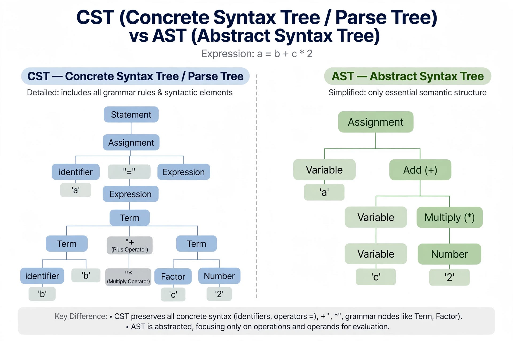

# Codebase Knowledge Graphs — Static Analysis, ASTs, Call Graphs, Symbol Resolution

> Companion to `14.neo4j.md` (graph storage) and `15.RAG.md` (retrieval). This note covers the piece those don't: how you actually turn a pile of source files into the nodes/edges you'd store in a graph DB. This is the core mechanism behind tools like Potpie, Sourcegraph, and any "chat with your codebase" product — the LLM answer is only as good as the structure extracted here.

---

## 1. Why this exists — the problem being solved

A vector-only RAG pipeline over code treats a function as a blob of text and finds "semantically similar" chunks. That fails for the questions engineers actually ask:

- "What breaks if I change this function's signature?" → needs **callers**, not similar text.
- "Where is this config value actually used?" → needs **references**, not similar text.
- "What does this module depend on?" → needs **imports/dependency edges**, not similar text.

These are all **structural** questions, not semantic ones. The answer is to parse code into an explicit graph — files, functions, classes, calls, imports — and let retrieval *traverse* that structure, optionally combined with vector search for the semantic side (see §12, and `14.neo4j.md` §11). Building that graph correctly, at the scale of a real enterprise monorepo, is a static analysis problem — the same discipline compilers and IDEs (language servers) use, not something you improvise with regex over source text.

---

## 2. Static analysis vs. dynamic analysis

| | Static analysis | Dynamic analysis |
|---|---|---|
| **When** | Without running the code | While the code executes |
| **Input** | Source text | Runtime traces, profiler output |
| **Examples** | Compilers, linters, `tree-sitter`, language servers, CodeQL | Debuggers, profilers, coverage tools, runtime call tracing |
| **Strength** | Covers all code paths, no execution env needed, fast/scalable | Resolves things static analysis can't (reflection, `eval`, dynamic dispatch) |
| **Weakness** | Can't resolve truly dynamic behavior (metaprogramming, duck-typed dispatch) | Only sees paths actually exercised at runtime |

Codebase knowledge graphs are built with **static analysis** — you need structure for code that's never been run, across an entire repo, without a working build environment. This is also why the graph is always an **approximation**: dynamically dispatched calls, `eval`, reflection-based wiring (e.g. Spring DI, Python's `getattr`) can't be resolved with certainty from text alone. Good tools flag these as "unresolved" rather than silently guessing wrong.

---

## 3. The parsing pipeline: text → tokens → tree

Every static analysis tool follows the same pipeline a compiler front-end uses:

```
source text --(lexer)--> tokens --(parser)--> parse tree / CST --(AST builder)--> AST
```

1. **Lexing (tokenizing)** — source text → stream of tokens (`def`, `foo`, `(`, `x`, `)`, `:`). Strips whitespace/comments (or keeps them as trivia, depending on the tool).
2. **Parsing** — tokens → tree, according to the language's grammar. Two related but distinct outputs:
   - **CST (Concrete Syntax Tree)** — includes *everything*: punctuation, parentheses, whitespace tokens if configured. Lossless — you could reconstruct the exact source text from it. **Tree-sitter produces a CST.**
   Tree-sitter is a parser generator and incremental parsing library built by GitHub. It doesn't give you a pure AST — it gives you a CST that feels like an AST.
   - **AST (Abstract Syntax Tree)** — a simplified tree that drops syntactic noise (parens, semicolons) and keeps only semantically meaningful structure. What Python's built-in `ast` module gives you.

3. Everything downstream (symbol tables, call graphs, dependency graphs) is built by **walking this tree**.

**Why the CST vs. AST distinction matters in practice:** a CST lets you do source-accurate things an AST can't — e.g. precise byte-range highlighting, formatting-preserving refactors, syntax-error-tolerant partial parses (see §4). An AST is easier to reason over semantically because there's less noise to filter out. Real pipelines often parse to a CST (tree-sitter) then build a simplified AST-like representation on top for graph construction.

| Feature | CST | AST |
| --- | --- | --- |
| Level | Concrete / Syntactic | Abstract / Semantic |
| Tokens | Keeps all (operators, delimiters) | Drops = ; ( ) as nodes, keeps them as meaning |
| Grammar nodes | Keeps Statement, Expression, Term | Drops them |
| Whitespace/comments | Can be kept | Always dropped |
| Use case | Code formatters, syntax highlighters, linters that need exact formatting | Compilers, interpreters, Babel, ESLint logic |
| Can reconstruct code? | Yes, 100% | No, formatting is lost |
---

## 4. Tree-sitter — the workhorse parser for multi-language tools

**What it is:** an incremental parser generator + runtime library. You give it a grammar for a language (already written for most mainstream languages — Python, JS/TS, Go, Java, C#, Rust, etc.) and it produces a **CST** for any source file in that language, using the same C core and API regardless of which language grammar is loaded.

This is *the* reason tools like Potpie, GitHub's code navigation, and countless IDE plugins use it: **one integration point, dozens of languages**, instead of hand-rolling a parser per language.

### Key properties that matter for a codebase-graph use case

- **Error-tolerant / partial parsing.** Real repos have syntax errors, half-written code, or files tree-sitter's grammar doesn't fully support. Tree-sitter still produces a best-effort tree with `ERROR` nodes marking the broken parts, rather than failing the whole file. Critical for scanning an entire enterprise monorepo where you can't assume every file is currently valid.
- **Incremental parsing.** Given an edit (a byte range that changed) and the *old* tree, tree-sitter re-parses only the affected subtree instead of the whole file. This is what makes it usable inside a live editor on every keystroke — and it's the same property you'd exploit for incremental graph updates on a `git diff` (see §9).
- **Uniform node-based API.** Every parsed file becomes a tree of typed nodes (`function_definition`, `call_expression`, `import_statement`, ...) navigable with the same API (`node.type`, `node.children`, `node.start_byte`/`end_byte`) no matter the source language — this uniformity is what lets one graph-construction pipeline handle many languages with per-language node-type mappings instead of a full rewrite per language.
- **Query language (S-expressions).** Instead of manually walking the tree with `if node.type == ...` everywhere, tree-sitter has a declarative query language to pattern-match nodes:

```scheme
; matches every function definition and captures its name
(function_definition
  name: (identifier) @function.name) @function.def

; matches every call expression and captures the callee name
(call
  function: (identifier) @call.callee) @call.expr
```

```python
import tree_sitter_python as tspython
from tree_sitter import Language, Parser, Query

PY_LANGUAGE = Language(tspython.language())
parser = Parser(PY_LANGUAGE)

tree = parser.parse(bytes(source_code, "utf8"))

query = Query(PY_LANGUAGE, """
(function_definition
  name: (identifier) @func_name) @func_def
""")
captures = query.captures(tree.root_node)
for name, node in captures.items():
    print(name, node)
```

This query-based extraction is exactly how you'd pull "every function definition" or "every call expression" out of a file to turn into graph nodes/edges, without writing a hand-rolled recursive tree walker per node type.

### Tree-sitter's limits (know these — they're where "good to have" becomes "real work")

- It gives you **syntax**, not **semantics**. It tells you `foo(x)` is a call expression whose callee identifier is `foo` — it does *not* tell you which `foo` (which module, which class, which of three overloads) that resolves to. That's symbol resolution (§7), a separate and harder problem layered on top.
- No built-in cross-file knowledge. Each file is parsed independently; stitching files together into one graph is your pipeline's job.
- Grammar quality varies by language/version — dialect edge cases (new syntax a grammar hasn't caught up to) can produce `ERROR` nodes even on valid code.

---

## 5. From AST/CST to graph nodes and edges

Once you can walk a parsed tree, graph construction is a mapping problem: **tree node types → graph entity types**, **tree relationships → graph edges**.

**Typical node types** (the graph's "labels", same concept as in `14.neo4j.md` §1):

| Node label | Extracted from |
|---|---|
| `Repository` / `Package` | top-level project structure |
| `File` / `Module` | one per source file |
| `Class` | `class_definition` nodes |
| `Function` / `Method` | `function_definition` nodes |
| `Variable` / `Field` | assignment targets, class attributes |
| `Endpoint` (framework-aware) | route decorators, e.g. `@app.get("/x")` — needs a language/framework-specific rule on top of raw syntax |

**Typical edge types** (relationships):

| Edge | Meaning | Source in the tree |
|---|---|---|
| `DEFINED_IN` | function/class belongs to a file | structural nesting in the AST |
| `CALLS` | function A calls function B | `call_expression` nodes inside A's body |
| `IMPORTS` | module A imports module B | `import_statement` nodes |
| `INHERITS` | class A extends class B | class definition's base-class list |
| `REFERENCES` | function/variable used but not called (e.g. passed as a value) | identifier usage outside call position |
| `TESTS` | test function targets a function | naming convention or explicit annotation — usually a heuristic, not pure syntax |

```cypher
// same property-graph model as 14.neo4j.md, applied to code
MERGE (f:File {path: "app/orders.py"})
MERGE (fn:Function {id: "app.orders.create_order"})
MERGE (fn)-[:DEFINED_IN]->(f)

MERGE (callee:Function {id: "app.pricing.compute_price"})
MERGE (fn)-[:CALLS]->(callee)
```

The `MERGE`-not-`CREATE` discipline from `14.neo4j.md` §3 matters even more here: a codebase graph pipeline re-runs constantly (every commit, every PR), so every write must be idempotent or you duplicate the entire graph on every re-scan.

---

## 6. Call graph construction

A **call graph** is the graph of "who calls whom" — nodes are functions/methods, edges are call sites.

**Static call graph construction, roughly:**

1. Walk every function body's AST, find all `call_expression` nodes.
2. For each call, get the **callee expression** (`foo`, `self.bar`, `obj.method()`, `module.func()`).
3. Resolve that expression to a concrete function definition (this step *is* symbol resolution — §7). If it can't be resolved confidently, mark the edge as `unresolved` rather than guessing.
4. Add a `CALLS` edge from the enclosing function to the resolved target.

**Why this gets hard fast, roughly in increasing order of pain:**

- **Direct calls** (`foo()` where `foo` is a plain top-level function) — easy, near 100% resolvable statically.
- **Method calls** (`obj.method()`) — need to know `obj`'s type to know which class's `method` you mean. Requires at least lightweight type inference or scope tracking.
- **Polymorphism / dynamic dispatch** — `obj.method()` where `obj`'s static type is a base class but the actual object at runtime is a subclass override. Static analysis typically resolves this to *all possible overrides* (a set of candidate edges) rather than one true edge — this is the standard, accepted imprecision in static call graphs.
- **Higher-order functions / callbacks** — a function passed as a value and invoked later (`handlers[event]()`, `list.map(fn)`) — the call site doesn't textually name the target.
- **Dynamic/reflective dispatch** — `getattr(obj, name)()`, dependency injection frameworks, `eval` — often un-resolvable without running the code (§2). These become graph gaps or require framework-specific heuristics (e.g. special-casing Spring `@Autowired` or FastAPI's `Depends()`).

A production system (this is roughly Potpie's problem space, and also what tools like CodeQL/Semgrep tackle) accepts this and reports **confidence**, not certainty — same idea as your resume's "confidence score" pattern in the PO-to-SO matching project, applied to graph edges instead of order-line matches.

---

## 7. Symbol resolution — the actually-hard part

A symbol is any named entity in source code that a program can refer to — a variable, function, class, method, parameter, module, or type name. It's the identifier itself, bound to a specific declaration.

Concretely:
```python
import numpy as np          # symbol: np (bound to the numpy module)

def compute_price(order):   # symbol: compute_price (a function)
    tax = order.rate * 0.1  # symbols: tax (variable), order (parameter), rate (attribute)
    return np.round(tax)    # symbol: np, .round (needs resolving to numpy.round)
```

**Symbol resolution** = given a name used somewhere (`compute_price`, `self.total`, `OrderService`), figure out *which declaration* it refers to. This is what turns "syntax" into "semantics," and it's the part tree-sitter explicitly does not do for you.

### Core mechanics

- **Scopes**: every language has nested scopes (module → class → function → block). A name reference resolves by walking outward from its innermost enclosing scope until a matching declaration is found (lexical/static scoping — same rule your Python/JS interpreter uses at runtime, just computed ahead of time here).
- **Symbol table**: a per-scope map of `name → declaration node`, built by walking the tree once to collect all declarations before resolving references.
- **Import resolution**: `from app.pricing import compute_price` means references to `compute_price` in this file resolve into `app/pricing.py`'s symbol table — this is what turns a per-file symbol table into a **cross-file** graph. Requires understanding the language's module/package system (Python's package `__init__.py` semantics, Java's classpath, Go's module paths, JS's `node_modules` resolution algorithm — all different, all needed if you support multiple languages).
- **Aliasing**: `import numpy as np` — `np.array` must resolve through the alias back to `numpy.array`.
- **Shadowing**: an inner-scope declaration hides an outer one with the same name — resolution must respect scope nesting order, not just "search everywhere and hope for one match."

### Why this is the crux of the whole problem

Tree-sitter gets you syntax for one file in milliseconds. Symbol resolution is what requires:
- Parsing (or at least indexing) the **entire dependency closure** of a file, not just the file itself.
- Language-specific module resolution rules — this is genuinely different work per language, unlike parsing (where tree-sitter mostly normalizes the differences away).
- Handling ambiguity gracefully (multiple candidates, none certain) instead of crashing or silently picking the first match.

This is also exactly the problem **Language Server Protocol (LSP)** implementations solve for IDEs — "go to definition," "find all references," "rename symbol" are all symbol resolution under the hood. A production codebase-graph tool either:
1. Re-implements a lightweight version of this per language (what tree-sitter-based tools typically do — pragmatic, approximate, fast), or
2. Shells out to real language servers / compilers (`gopls`, `pyright`, `tsserver`, `jdtls`) for ground-truth resolution — slower and heavier, but exact, and it's how Sourcegraph's **SCIP**/older **LSIF** indexing format gets its precision.

**Rule of thumb worth remembering for interviews:** *parsing is a solved, mostly-uniform problem (tree-sitter); symbol resolution is the actual hard, language-specific problem, and it's what determines whether your "knowledge graph" is trustworthy or just a fancy-looking approximation.*

---

## 8. Dependency graph extraction

A layer up from call graphs: **module/package-level** dependencies rather than function-level.

- **Nodes**: files, modules, or packages.
- **Edges**: `IMPORTS`/`DEPENDS_ON`, derived directly from `import`/`require`/`using` statements — much easier to extract than call graphs, since import statements are almost always statically explicit (dynamic imports being the exception, e.g. `importlib.import_module(computed_name)`).
- **Common uses once built:**
  - **Cycle detection** — a dependency cycle between modules is a classic architectural smell; trivial to check once you have the graph (standard graph-cycle-detection, e.g. DFS with a recursion stack, or `gds.cycle` style algorithms as in `14.neo4j.md` §6).
  - **Blast-radius analysis** — "what depends on this module, transitively" is a reverse-BFS/traversal from the target node, same *N*-hop pattern as `14.neo4j.md`'s `*1..N` Cypher syntax.
  - **Layering violations** — e.g. a "domain" package importing from an "infra" package when your architecture rules say it shouldn't; this is a graph-shaped lint rule (tools like `import-linter` and ArchUnit effectively encode this over a dependency graph).

---

## 9. Incremental construction at scale

A knowledge graph for an enterprise monorepo can't be rebuilt from scratch on every commit — too slow, and it thrashes the graph DB with churn. Practical approach:

1. **Diff-driven re-parsing.** Use `git diff` to get the set of changed files. Re-parse (tree-sitter) only those files — this directly reuses tree-sitter's incremental-parsing property from §4, applied at repo scale instead of keystroke scale.
2. **Localized graph updates.** For each changed file: remove its old nodes/edges, re-extract, `MERGE` the new ones back in. Edges *into* a changed file from elsewhere (incoming calls/imports) may also need re-resolution if the file's public symbols changed shape.
3. **Symbol resolution cache.** Cross-file resolution (§7) is the expensive part — cache per-file symbol tables so an unrelated file's edit doesn't force re-resolving the whole repo, only the files that actually import/reference the changed one.
4. **Parallelism.** Per-file parsing is embarrassingly parallel (no shared state needed until the merge/write step) — scale by sharding files across workers, then serialize only the graph-write step.

This is the same operational shape as CI: fast on a small diff, and the design has to actively avoid "full repo rescan" as the default path, or it won't hold up on a real enterprise codebase (the JD's actual working environment).

---

## 10. Existing tools worth knowing by name

You don't need to have used all of these, but recognizing them signals you understand the landscape:

| Tool | What it does |
|---|---|
| **tree-sitter** | Multi-language incremental parser (this note's §4) — the parsing layer almost everyone in this space builds on |
| **Language Server Protocol (LSP)** implementations (`pyright`, `gopls`, `tsserver`, `jdtls`, `rust-analyzer`) | Full symbol resolution + type checking per language — ground truth, but language-specific and heavier to run at scale |
| **SCIP** (Sourcegraph's successor to **LSIF**) | A standard *index format* for precise cross-file code intelligence (defs/refs/hovers), generated by per-language indexers, consumed uniformly — the "compile once, query anywhere" approach to symbol resolution |
| **ctags / universal-ctags** | Old-school, syntax-only symbol indexer (no real resolution) — fast, shallow, still used for quick jump-to-definition in editors |
| **CodeQL** | Treats a codebase as a queryable database (like SQL, but the "tables" are AST/CFG/dataflow facts) — built for deep semantic queries (security vulns, "find all calls to X without a null check") rather than lightweight graph construction |
| **Semgrep** | Pattern-based static analysis, lighter-weight than CodeQL, syntax-aware (built on tree-sitter-like matching) rather than full symbol resolution |

**Where a tool like Potpie sits:** pragmatically closest to the tree-sitter + custom lightweight symbol resolution + graph-DB row — favoring fast, good-enough, multi-language coverage over the precision (and cost) of running a full language server per language.

---

## 11. Storing the graph — mapping onto Neo4j

Directly reuses everything in `14.neo4j.md`. The only new part is the schema:

```cypher
// Schema sketch for a codebase KG
(:Repository {name})
(:File {path})-[:PART_OF]->(:Repository)
(:Function {id, name, signature})-[:DEFINED_IN]->(:File)
(:Class {id, name})-[:DEFINED_IN]->(:File)
(:Function)-[:METHOD_OF]->(:Class)
(:Function)-[:CALLS {confidence: "high"|"low"}]->(:Function)
(:File)-[:IMPORTS]->(:File)
(:Class)-[:INHERITS]->(:Class)
```

- Store **confidence** as an edge property on `CALLS` edges resolved ambiguously (§6) — lets retrieval/ranking logic later downweight uncertain edges instead of treating every edge as ground truth.
- Bulk-load with `UNWIND` batching (`14.neo4j.md` §8), since a single repo scan can produce tens of thousands of nodes/edges in one pipeline run.
- Use uniqueness constraints on stable IDs (e.g. fully-qualified name, or `file_path:line:col`) so re-running the pipeline `MERGE`s onto existing nodes instead of duplicating (`14.neo4j.md` §4).

---

## 12. Using the graph for retrieval (why this was worth building)
999

1. Vector search finds a **semantically** relevant starting point (e.g. the function whose docstring best matches the user's question).
2. From that node, **traverse** the graph — its callers, its callees, its imports, its class hierarchy — to pull in **structurally** relevant context the vector search alone would miss (a helper function with a generic docstring that a pure similarity search would rank low, but that's actually called directly by the matched function).
3. Feed the union of "semantic hit + structural neighborhood" to the LLM as context, instead of just top-k similar chunks.

This is also the answer to "debug bad RAG answers" from `14.neo4j.md` §11, made concrete for code: if answers are missing obviously-relevant context, check whether the graph actually has the `CALLS`/`IMPORTS` edges you expect (`MATCH (f:Function)-[:CALLS]->(g) RETURN count(*)`) before assuming the retrieval ranking is at fault — an incomplete or mis-resolved graph (bad symbol resolution, §7) is a far more common root cause than a bad retrieval algorithm.

---

## 13. Common pitfalls (the "sounds easy, isn't" list)

- **Regex-based "parsing."** Tempting for a quick prototype (`grep def \w+`), but breaks immediately on nested scopes, multi-line signatures, string literals containing code-like text, and any language subtlety — always a proper parser (tree-sitter), never regex, for anything beyond a toy.
- **Treating call-graph edges as certain.** As covered in §6 — polymorphism, callbacks, and reflection mean some percentage of edges are genuinely ambiguous; a graph that silently picks one guess per ambiguous call will occasionally be confidently wrong.
- **Ignoring incremental updates until it's too late.** A pipeline that only knows how to rebuild the whole graph from scratch works fine in a demo and falls over on a real enterprise repo with thousands of files and constant commits (§9).
- **Underestimating symbol resolution, over-investing in parsing.** Parsing is the easy 80%; naive projects often polish tree-sitter integration to a shine while cross-file resolution is a hacky string-matching guess — that's backwards relative to where the actual value (and actual difficulty) is.
- **No confidence/provenance on edges.** Without a confidence signal, there's no way for downstream retrieval or ranking to know which edges to trust — bake it in at construction time, not as an afterthought.

---

## 14. Quick interview-answer summary

- **The problem**: turn source code into a structured graph (files, functions, classes, calls, imports) so retrieval/reasoning over a codebase can use *structural* relevance, not just text similarity.
- **Pipeline**: lex → parse → tree (CST/AST) → walk tree → extract nodes/edges → resolve symbols cross-file → write to graph DB, incrementally on diffs.
- **Tree-sitter**: incremental, error-tolerant, multi-language parser generator — gives you a uniform CST and a query language across languages; **it gives you syntax, not semantics.**
- **The hard part isn't parsing, it's symbol resolution**: matching a name reference to its actual declaration across files/imports/scopes/aliases — this is what LSP servers do for IDEs, and it's the difference between a real knowledge graph and a syntax-only approximation.
- **Call graphs are inherently approximate**: direct calls resolve cleanly; polymorphism, callbacks, and reflection require heuristics or confidence scores, never blind certainty.
- **Scale requires incrementality**: diff-driven re-parsing + cached symbol tables + `MERGE`-based idempotent graph writes, not full-repo rebuilds per commit.
- **Payoff**: semantic (vector) search finds the entry point, graph traversal pulls in the structurally-relevant neighborhood — this combination is why graph-augmented code RAG beats plain vector search, and it's the mechanism a product like Potpie is actually selling.
