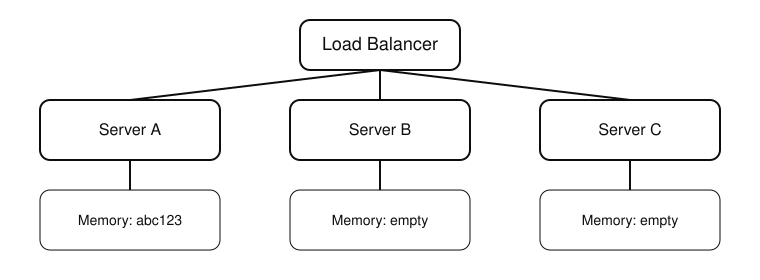
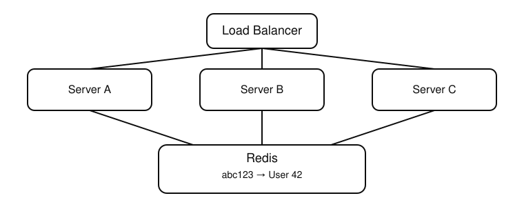

## 1. Redis data structures — and when each fits
Remote dictionary server
Redis is an in-memory key-value store, but the "value" can be one of several structures, each suited to a different access pattern. Picking the right one is a common interview probe.

| Structure | Shape | Typical production use |
|---|---|---|
| **String** | key → single value (text, number, or serialized JSON/binary) | Cache a rendered API response, a session blob, a counter (`INCR`) |
| **Hash** | key → field/value map (like a mini dict) | Cache a whole object (`user:123` → `{name, email, plan}`) without JSON-encoding/decoding the whole thing to update one field |
| **List** | key → ordered sequence, push/pop from either end | A simple work queue, "recent activity" feed (`LPUSH` + `LTRIM` to cap size) |
| **Set** | key → unordered unique members | Tag membership, "has this user already done X" checks, set intersection (mutual followers) |
| **Sorted Set (ZSET)** | key → members each with a numeric score, kept ordered | Leaderboards, rate limiting windows (score = timestamp), priority queues, "top N" queries |
| **Stream** | key → append-only log of entries with IDs | Event/message log with consumer groups — a lighter-weight Kafka-ish pattern when you don't want to run Kafka |

 {entity}:{id} (or {entity}:{id}:{sub-field})

**String vs Hash — a common trap**: caching an object as a JSON string means any single-field update requires read-decode-mutate-encode-write (and a wasted round trip if you only needed to bump one field). A Hash lets you `HSET user:123 plan "pro"` directly. Use a Hash when the object has fields that update independently and often; use a String when you always read/write the whole blob together (simpler, and serialization is trivial with Pydantic's `.model_dump_json()`).

```python
import redis
r = redis.Redis(host="localhost", port=6379, decode_responses=True)

# String
r.set("session:abc123", session_json, ex=1800)

# Hash
r.hset("user:123", mapping={"name": "Mahesh", "plan": "pro"})
r.hget("user:123", "plan")

# Sorted set — leaderboard / rate limiting
r.zadd("leaderboard", {"user:123": 4200})
r.zrevrange("leaderboard", 0, 9, withscores=True)  # top 10
```

---

## 2. Caching patterns

### Cache-aside (lazy loading) — the default choice

The app owns the logic: check cache first, fall back to the DB, populate the cache on a miss.

```python
def get_order(order_id: int) -> Order:
    key = f"order:{order_id}"
    cached = r.get(key)
    if cached:
        return Order.model_validate_json(cached)

    order = db.get(Order, order_id)          # cache miss — hit the DB
    r.set(key, order.model_dump_json(), ex=300)
    return order
```
- **Pros**: only what's actually requested gets cached (no wasted memory on cold data); cache and DB can be independent — a cache failure just means every request falls through to the DB (degraded latency, not an outage).
- **Cons**: the *first* request for any key always pays the full DB latency (cache miss penalty); on a cold cache after a restart, a burst of traffic can "thundering herd" the DB (see mitigation below).
- This is the pattern you used for session storage, and it's the right default for most read-heavy API caching.

### Write-through

The app writes to the cache *and* the DB together, synchronously, on every write — the cache is never stale because it's updated at write time, not lazily on next read.

```python
def update_order_status(order_id: int, status: str):
    db.execute(update(Order).where(Order.id == order_id).values(status=status))
    db.commit()
    r.set(f"order:{order_id}", get_order_json(order_id), ex=300)  # update cache immediately
```
- **Pros**: cache is always warm and consistent right after a write — no read ever misses right after a write.
- **Cons**: every write pays the extra cache-write latency/failure mode; you cache data that might never be read again (wasted memory) if writes vastly outnumber reads on some keys.
- Use when read-after-write consistency matters and the entity is reliably re-read soon (e.g., a user's own profile after they edit it).

### Write-behind (write-back) — mentioned for completeness, rarely the first choice

Write to cache immediately, flush to the DB asynchronously later (batched). Higher write throughput, but risks data loss if the process crashes before the flush — only worth the complexity for very high write-volume, loss-tolerant data (metrics counters, view counts).

**Interview one-liner distinguishing them**: cache-aside = read path decides; write-through = write path keeps cache in sync; write-behind = write path defers the DB write for throughput at the cost of durability.

---

## 3. TTL selection

TTL (`EX`/`ex=`) is the main lever for balancing staleness vs cache-hit-rate.

- **Too short** → low hit rate, cache barely helps, DB still takes most of the load.
- **Too long** → stale data served long after the source changed; for something like pricing or inventory, that's a correctness bug, not just a UX nit.

Rules of thumb used in practice:
- Match TTL to how often the underlying data actually changes and how tolerant the use case is of staleness — a product catalog entry might be minutes, a session token might be its actual auth expiry window, a computed "trending items" list might be an hour.
- **Add jitter** to TTLs for data that's all populated at once (e.g., a cache warm after a deploy) — if 10,000 keys all expire at exactly the same second, you get a synchronized stampede of cache misses hitting the DB simultaneously. `ex=300 + random.randint(0, 30)` spreads the expiry out.
- Session TTL should track your actual session/auth policy (e.g., 30 min idle timeout) rather than being picked independently — this is the pattern from your Redis-backed session storage: TTL *is* the session expiry mechanism, refreshed (`EXPIRE`) on each authenticated request to implement sliding expiration.

---

## 4. Cache invalidation — "the classic two hard problems in CS"

("There are only two hard things in Computer Science: cache invalidation and naming things.")

The problem: once data changes at the source, every place that cached the old value needs to find out — and there's no single correct way to guarantee that without either over-invalidating (losing cache benefit) or under-invalidating (serving stale data).

### Strategies, roughly in order of how often they're used

1. **TTL-based expiry (passive)** — simplest: just let it expire and re-populate on next read. Accepts some staleness window by design. Works for most read caching where "a few minutes stale" is acceptable.
2. **Explicit invalidation on write** — the write path deletes (or updates) the cache key(s) affected, so the *next* read is forced to hit the DB and repopulate.
   ```python
   def update_order_status(order_id: int, status: str):
       db.execute(update(Order).where(Order.id == order_id).values(status=status))
       db.commit()
       r.delete(f"order:{order_id}")   # invalidate, don't try to keep it in sync — next read repopulates
   ```
   Deleting (cache-aside style) is usually safer than updating the cache in place on write, because it avoids ever writing an inconsistent value if the write path has bugs or partial failures — the worst case degrades to a cache miss, not wrong data served.
3. **Invalidate by pattern/tag** — when one write affects many cached keys (e.g., a customer's discount tier changes, invalidating every cached order for that customer), you need either a naming convention you can `SCAN`+`DEL` by pattern (avoid `KEYS *` in production — it blocks the single-threaded Redis event loop; use `SCAN` which is cursor-based and non-blocking), or maintain a secondary index (a Set of keys per customer) you can look up and bulk-delete.
4. **Event-driven invalidation** — the write publishes an event (via pub/sub, or a message queue/Kafka — Topic 23) and any service/instance holding a local or shared cache for that entity invalidates on receiving it. Needed when multiple services/processes each keep their own cache copy and a single process's `DEL` isn't enough to reach all of them.

**The core tension to name in an interview**: invalidate too aggressively and you lose most of the caching benefit (constant re-population); invalidate too conservatively (or not at all, relying only on TTL) and you risk serving stale data for up to the full TTL window after every write. There's no universal right answer — it's a per-entity tradeoff based on how bad staleness is for that data vs. how expensive re-computation is.

---

## 5. Redis for session storage

User A gets sessioned in Server A's memory, next time user A sends request, load balancer will route to server C.. now user A has to log in again..

Why Redis over server-side in-memory sessions or a DB table:
- **Statelessness for horizontal scaling** (Topic 21) — if session state lived in each app instance's memory, a user's requests would need to always hit the *same* instance (sticky sessions), which breaks simple load balancing and autoscaling. Externalizing sessions to Redis lets any instance serve any request.
- **Speed** — sub-millisecond reads, far faster than a DB round trip on every authenticated request.
- **Built-in expiry** — `EXPIRE`/`SETEX` gives you session TTL for free, no cron job sweeping expired rows out of a DB table.

```python
def create_session(user_id: int) -> str:
    session_id = secrets.token_urlsafe(32)
    r.hset(f"session:{session_id}", mapping={"user_id": user_id, "created_at": time.time()})
    r.expire(f"session:{session_id}", 1800)   # 30 min TTL
    return session_id

def get_session(session_id: str) -> dict | None:
    data = r.hgetall(f"session:{session_id}")
    if not data:
        return None
    r.expire(f"session:{session_id}", 1800)    # sliding expiration — refresh TTL on access
    return data
```
- **Sliding vs absolute expiration**: refreshing the TTL on every access (above) means an active user never gets logged out mid-use; an absolute expiration (set once, never refreshed) forces re-auth after a fixed window regardless of activity — pick based on the security/UX tradeoff (financial apps often want absolute session caps).
- JWT vs Redis-backed sessions is a related, frequently-asked contrast: a JWT is self-contained and needs no server-side lookup (stateless, scales trivially) but can't be revoked before its expiry without extra machinery (a blocklist — itself usually kept in Redis); a Redis-backed session can be revoked instantly (`DEL` the key) and can hold arbitrary server-side state, at the cost of a lookup per request and a stateful dependency.

---

## 6. Rate limiting — token bucket via Redis

Goal: cap how many requests a client (user/IP/API key) can make in a window, and reject/queue the rest with `429 Too Many Requests` (Topic 8's status code table).

### Token bucket concept
Each client has a bucket that holds up to `capacity` tokens, refilling at `rate` tokens/second. Each request consumes one token; if the bucket is empty, the request is rejected. This allows short bursts up to the bucket capacity while enforcing a steady average rate — more forgiving than a hard fixed window.

### Simple fixed-window counter (easiest to reason about, good enough for many cases)
Imagine a limit of 5 requests every 10 seconds.
- **Edge-of-window burst problem**:
Although the policy says "5 requests every 10 seconds," the client actually sent:
- 5 requests in the last few milliseconds before 10s
- 5 more immediately after 10s
- So 10 requests were accepted within roughly 0.1 seconds.

That's 2× the intended rate, caused entirely by the window boundary.

Why Token Bucket doesn't have this issue
A Token Bucket with capacity = 5 and refill = 0.5 tokens/second (5 tokens every 10 seconds) would:
- Allow the first 5 requests.
- Empty the bucket.
- Require waiting for tokens to refill before allowing more requests.


### Sliding-window / token-bucket via a sorted set (more accurate)
- Instead of counting requests per minute, keep the timestamp of every request.
- At any moment:
"How many requests happened during the last 60 sec?" (1 min -> 5 requests allowed)
- Redis has a data structure called a Sorted Set (ZSET).
Each item has:
    - a member (unique value)
    - a score (number used for sorting)

- Redis automatically keeps them ordered by score.
- For rate limiting:
    - Member = unique request ID (often timestamp + random suffix)
    - Score = request timestamp
---

## 7. Pub/Sub for lightweight messaging

Redis Pub/Sub lets publishers broadcast messages on a channel to any currently-subscribed listeners.

```python
# Publisher
r.publish("order_updates", json.dumps({"order_id": 5, "status": "shipped"}))

# Subscriber
pubsub = r.pubsub()
pubsub.subscribe("order_updates")
for message in pubsub.listen():
    if message["type"] == "message":
        handle(json.loads(message["data"]))
```

**When it fits**: fire-and-forget notifications where losing a message occasionally is acceptable — e.g., pushing a live update to WebSocket-connected clients across multiple app instances (instance A gets the update, publishes it, every instance's subscriber relays it to its own connected WebSocket clients).

**Why it's not a task queue / message broker replacement** — the interview trap to name explicitly:
- **No persistence** — if no one is subscribed at publish time, the message is gone. Compare to Celery/RabbitMQ/Kafka (Topic 11/23), where messages sit in a durable queue until a consumer is ready.
- **No delivery guarantee / ack** — no at-least-once semantics, no redelivery on consumer crash.
- **No consumer groups / load balancing** built in the classic Pub/Sub API (Redis **Streams**, `XADD`/`XREADGROUP`, does add consumer groups and persistence — closer to a real log/queue, and is the right Redis-native choice when you need those guarantees instead of Celery/Kafka).

Use Pub/Sub for ephemeral broadcast (live notifications, cache-invalidation events across instances); use Celery/a real broker/Streams when a message must not be lost and must be processed exactly once (or at-least-once with idempotency, per Topic 11).

---

## 8. Eviction policies (ties into TTL selection)

Redis is memory-bounded (`maxmemory`); once full, it needs a policy for what to evict to make room for new writes.

| Policy | Behavior |
|---|---|
| `noeviction` | Reject writes with an error once full — safest for data you can't afford to lose (e.g., a primary data store use of Redis), worst for pure caching |
| `allkeys-lru` | Evict the least-recently-used key, regardless of TTL — good general-purpose cache policy |
| `volatile-lru` | LRU, but only among keys that have a TTL set — keys without a TTL are treated as "must keep" (e.g., permanent config) |
| `allkeys-lfu` / `volatile-lfu` | Evict least-*frequently*-used instead of least-recently — better than LRU when access frequency, not recency, indicates value (a popular key accessed constantly but not in the last minute shouldn't be evicted) |
| `volatile-ttl` | Evict the key closest to expiring first |

For a pure cache-aside deployment, `allkeys-lru` (or `-lfu` if access patterns are skewed/bursty) is the common choice — every key is disposable, TTL is about correctness/staleness, eviction is about memory pressure, and the two can be reasoned about independently.

---

## 9. Quick interview-answer summary

- **"Cache-aside vs write-through?"** — cache-aside: read path populates on miss, DB is source of truth, simplest and most common; write-through: write path keeps cache warm synchronously, better read-after-write consistency, more write latency/complexity.
- **"How do you pick a TTL?"** — match to how fast the source data changes and how much staleness the use case tolerates; add jitter to avoid synchronized mass-expiry stampedes.
- **"How do you invalidate a cache correctly?"** — prefer delete-on-write over update-in-place (fails safe to a cache miss, not a wrong value); use `SCAN`-based pattern deletes or a secondary key index for one write affecting many cached keys, never `KEYS *` in production.
- **"Why Redis for sessions instead of in-memory?"** — statelessness for horizontal scaling/load balancing, built-in TTL for expiry, shared across instances.
- **"How would you rate-limit an API?"** — token bucket / sliding window via a Redis sorted set, wrapped in a pipeline or Lua script for atomicity under concurrent requests from the same client.
- **"Why not use Redis Pub/Sub as your task queue?"** — no persistence and no delivery guarantee; a subscriber that isn't connected at publish time loses the message. Use Streams or a real broker (Celery/RabbitMQ/Kafka) when messages must not be lost.
